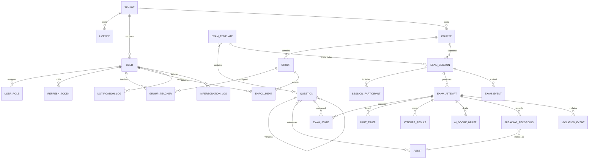

# Entity Relationship Diagram — APTIS LMS

## Entity Relationship Diagram

## Entity Descriptions

| Entity | Description | Key Attributes | Relationships |
|---|---|---|---|
| TENANT | Isolated customer namespace | id, slug, status, timezone | licenses, users, courses |
| LICENSE | Seat and expiry grant | tenant_id, seat_count, expiry_date, status | tenant, history actor |
| USER | Vendor or tenant identity | tenant_id nullable, email, password_hash, status | roles, tokens, enrollments |
| USER_ROLE | Multi-role assignment | user_id, tenant_id, role, revoked_at | user |
| REFRESH_TOKEN | Rotating session credential hash | user_id, token_hash, expires_at, replaced_by | user |
| COURSE | Time-bounded learning container | tenant_id, start_date, end_date | groups, sessions |
| GROUP | Class within course | course_id, tenant_id, name | teachers, enrollments |
| GROUP_TEACHER | Teacher/group join | group_id, teacher_user_id | group, user |
| ENROLLMENT | Active or historical student membership | tenant_id, student_user_id, group_id, unenrolled_at | group, user |
| QUESTION | Versioned global content item | parent_id, version, skill, part, content | assets, templates, answer state |
| ASSET | Private media/export metadata | tenant_id nullable, storage_key, mime_type | questions, recordings |
| EXAM_TEMPLATE | Published question/timing definition | skill_sequence, questions, status | questions, sessions |
| EXAM_SESSION | Scheduled tenant deployment | tenant_id, course_id, template_id, time window | participants, attempts, events |
| SESSION_PARTICIPANT | Eligible student join | session_id, student_user_id | session, user |
| EXAM_ATTEMPT | Student execution/state machine root | session_id, attempt_number, status, shuffle_seed | answers, timers, results, media |
| EXAM_STATE | Latest accepted answer per question | attempt_id, question_id, answer_value, sequence_number | attempt, question |
| PART_TIMER | Server-authoritative part clock | attempt_id, skill, part, started_at, extensions | attempt |
| ATTEMPT_RESULT | Final per-skill result | attempt_id, skill, raw_score, band, status | attempt, confirmer |
| AI_SCORE_DRAFT | Non-visible provider result | attempt_id, part, provider statuses, draft data | attempt |
| SPEAKING_RECORDING | Audio metadata and durability state | attempt_id, part, asset_id, upload_status, is_partial | attempt, asset |
| VIOLATION_EVENT | Append-only integrity event | attempt_id, type, occurred_at, cumulative_count | attempt |
| EXAM_EVENT | Append-only intervention event | session_id, attempt_id, actor, type, reason | session, attempt |
| NOTIFICATION_LOG | Delivery attempt audit | recipient, type, channel, status, idempotency_key | user |
| IMPERSONATION_LOG | Support read-only session audit | support_user_id, tenant_id, start/end | user, tenant |

## Indexes and Constraints

- Unique tenant slug; unique normalized email within tenant and unique Vendor email in Vendor scope.
- Unique active role assignment `(user_id, tenant_id, role)` and group teacher `(group_id, teacher_user_id)`.
- Unique active enrollment `(student_user_id, group_id)` where `unenrolled_at IS NULL`.
- Unique attempt `(session_id, student_user_id, attempt_number)`.
- Unique answer `(attempt_id, question_id)`; update only when incoming `sequence_number` is greater.
- Unique timer `(attempt_id, skill, part)` and result `(attempt_id, skill)`.
- Index every tenant table beginning with `tenant_id`; hot exam indexes include `(attempt_id, saved_at)` and `(session_id, status)`.
- Partial indexes cover active licenses, active enrollments, non-revoked roles and pending scoring jobs.
- `violation_events`, `exam_events`, `notification_log`, `impersonation_log`, and license history are append-only for application roles.
- Question/template/band-map versions referenced by attempts cannot be mutated.
- PostgreSQL RLS policies use transaction-local tenant context and deny access when context is absent, except explicitly privileged Vendor operations.
