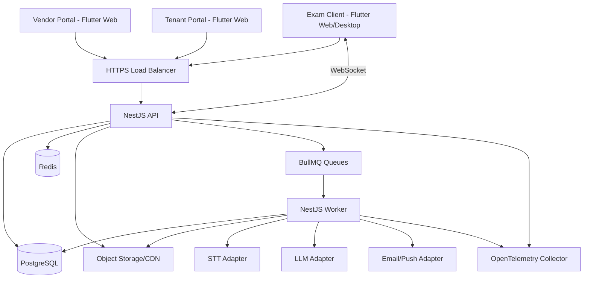
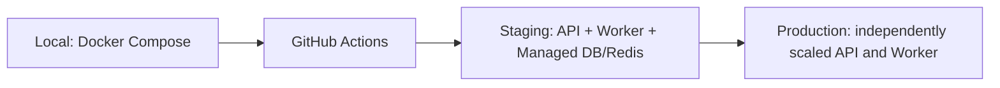

# System Architecture — APTIS LMS

## Overview

APTIS LMS uses a senior-level DDD/Clean Architecture implemented as a NestJS modular monorepo. The backend contains two independently deployable applications—`api` for synchronous REST/WebSocket exam traffic and `worker` for asynchronous scoring, notifications, analytics, exports, and scheduled jobs—while bounded-context libraries preserve a single domain model and explicit dependency rules.

The v1 topology is a modular monolith rather than distributed microservices. This keeps transactions, tenant isolation, and deployment understandable while leaving clean extraction seams at queue messages and application ports.

## Component Architecture

### Component Descriptions

| Component | Responsibility | Technology |
|---|---|---|
| API application | REST `/api/v1`, authentication, tenant context, RBAC, synchronous exam writes/timers, WebSocket monitor | NestJS 11 / Node.js 22 LTS |
| Worker application | STT/LLM pipelines, notifications, exports, item analysis, purge and scheduled jobs | NestJS standalone context + BullMQ |
| PostgreSQL | ACID source of truth, tenant-scoped records, immutable audit data, outbox | PostgreSQL 17+ managed |
| Redis | BullMQ transport, distributed locks, rate limits, WebSocket pub/sub, short-lived cache | Redis 7+ |
| Object Storage/CDN | Private Speaking audio, Listening assets, images, generated exports | Provider adapter over S3/GCS-compatible APIs |
| Observability | Correlated JSON logs, traces, metrics and alerts | Pino + OpenTelemetry |

## Bounded Contexts and Dependency Rules

| Context | Ownership |
|---|---|
| IAM | Users, roles, permissions, credentials, sessions and refresh-token rotation |
| Tenancy | Tenant resolution, configuration, status and cross-tenant enforcement |
| Licensing | Seat quota, license lifecycle, immutable license history and alerts |
| Learning | Courses, groups, teacher assignments and enrollments |
| Question Bank | Questions, versions, media assets, templates and band mappings |
| Exam Operations | Session scheduling, participants, interventions and live monitoring |
| Exam Delivery | Attempts, answer state, timers, transitions, submission and resume |
| Integrity | Shuffle seeds, violations, thresholds and integrity reports |
| Scoring | Auto-score, STT/LLM drafts, human review and final results |
| Analytics | Student/class/tenant/item analysis read models and exports |
| Notifications | Templates, preferences, delivery jobs and delivery logs |
| Audit | Append-only operational, impersonation and security event views |

Dependencies point inward: `presentation → application → domain`. Infrastructure implements domain/application ports. A domain package cannot import NestJS, Prisma, BullMQ, a cloud SDK, or another context's infrastructure. Cross-context coordination uses application contracts or versioned integration events, never direct access to another context's repository.

## Data Flow

1. The API resolves the tenant from the trusted `Host` header before authentication and stores the resolved context in `AsyncLocalStorage`.
2. Authentication validates rotating JWT sessions; authorization evaluates the union of active permissions and teacher/group scope.
3. Commands execute domain invariants and persist through repository ports. Critical exam writes and the matching outbox event commit in one PostgreSQL transaction.
4. The outbox relay publishes versioned jobs/events to BullMQ. Worker handlers are idempotent and record retry/dead-letter outcomes.
5. WebSocket state is published through Redis so coordinators connected to another API instance still receive updates.
6. Analytics is served from query/read-model projections; it must not join or lock the high-frequency answer-write path.

## Deployment Model

- Local development uses Docker Compose for PostgreSQL and Redis.
- Staging mirrors production topology with isolated credentials and anonymized fixtures.
- Production deploys API and Worker from the same immutable image/version but with different commands.
- API instances are stateless; Redis provides shared pub/sub and job state.
- Database migrations follow expand–migrate–contract and run as a controlled release job.
- Exam traffic has independent autoscaling and health checks from Worker capacity.

## Security Architecture

- TLS 1.2+ is mandatory; proxy headers are trusted only from approved load balancers.
- Tenant identity is resolved from host/subdomain, never accepted from a client-selected header or request body.
- PostgreSQL tenant policies provide defense in depth in addition to repository scoping.
- JWT access tokens expire within 15 minutes; refresh tokens expire within 7 days, rotate on every use, and are stored only as hashes.
- RBAC uses explicit permissions plus resource-scope policies. UI hiding is not authorization.
- DTO validation uses allow-list semantics; unknown fields are rejected. ORM parameters prevent SQL injection.
- Private objects use short-lived scoped upload/download URLs. Speaking audio and transcripts are treated as PII.
- Rate limits apply to login, reset, answer writes, WebSocket events and presigned-URL issuance.
- Audit, intervention, violation and license-history records are append-only for application identities.
- Logs redact passwords, tokens, answers, transcripts, audio payloads and provider secrets.

Top threats and controls:

| Threat | Primary controls |
|---|---|
| Cross-tenant IDOR/data leak | Host-based tenant context, repository enforcement, PostgreSQL RLS, mandatory isolation tests |
| Exam manipulation/replay | Server timers, optimistic sequence numbers, attempt state machine, idempotency keys, immutable events |
| Credential/provider-secret theft | Short token TTL, refresh rotation, secret manager, log redaction, scoped service identities |

## Gate 1: Design Freeze

**Status:** DECLARED  
**Date:** 2026-06-20  
**Architecture baseline:** NestJS modular monorepo with independently deployable API and Worker; DDD/Clean bounded contexts; PostgreSQL source of truth; Redis/BullMQ asynchronous boundary; adapter-based cloud and AI integrations.  
**Change protocol:** Any change to deployable boundaries, database ownership, tenant model, authentication model, queue semantics, or critical exam persistence requires a new ADR and impact review across BA, PM, Dev, Tester, and QA artifacts.

## Flags from Previous Agents

### FLAG-TECHLEAD-001
**Severity:** Major  
**Source artifact:** `requirements.md` and SRS Master Index  
**Issue:** FR priority totals disagree: plan 106/5, Master Index 104/7, actual FR headings 103/8; FR-08 is the visible mismatch.  
**Suggestion:** Product must confirm FR-08 release status and regenerate summary counts before sprint commitment.

### FLAG-TECHLEAD-002
**Severity:** Blocker  
**Source artifact:** SRS NFR-14 / OI-08  
**Issue:** A literal 0% media loss guarantee cannot be satisfied when a device powers off before an unuploaded local audio buffer reaches durable storage.  
**Suggestion:** Define the guarantee as zero loss for server-acknowledged answers and uploaded/acknowledged audio chunks; resolve power-loss policy in OI-08.

### FLAG-TECHLEAD-003
**Severity:** Major  
**Source artifact:** SRS database section and Master Index  
**Issue:** Master Index states 22 entities, while the database document defines 24 entity headings.  
**Suggestion:** Correct the summary and use the 24-entity database section as the current source until the model is refined.

### FLAG-TECHLEAD-004
**Severity:** Major  
**Source artifact:** OI-07  
**Issue:** Cloud region, retention, deletion, backup-purge behavior and audio cost cannot be frozen before Legal resolves NĐ 13/2023 obligations.  
**Suggestion:** Keep provider adapters and configurable retention policies; do not select a production cloud region in this Gate 1 baseline.
