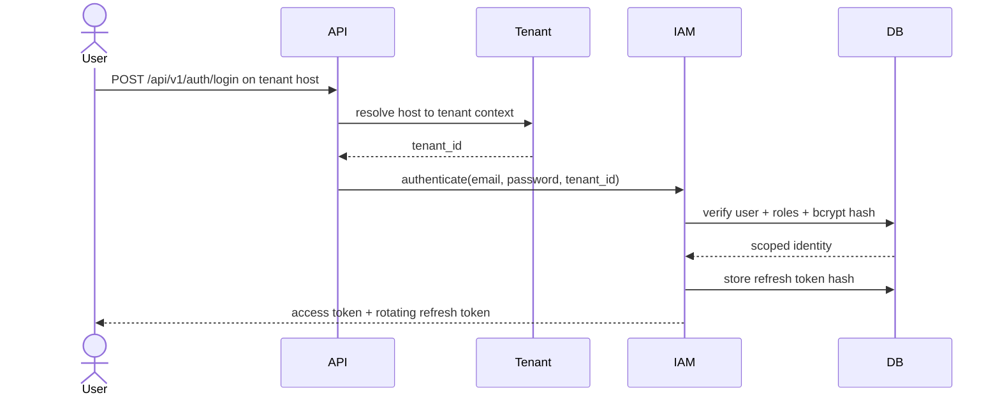
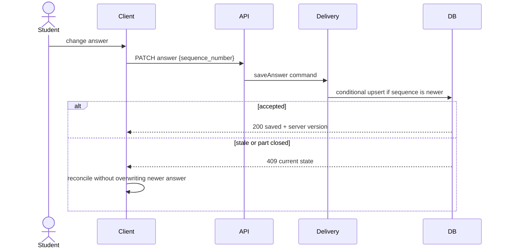
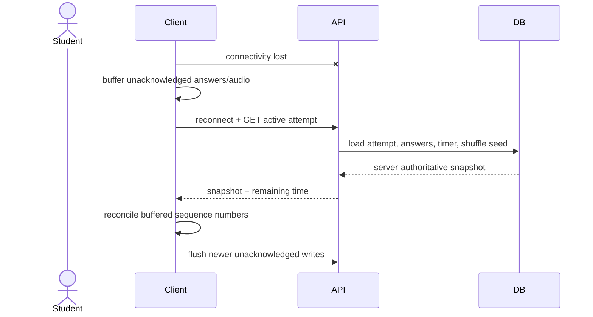
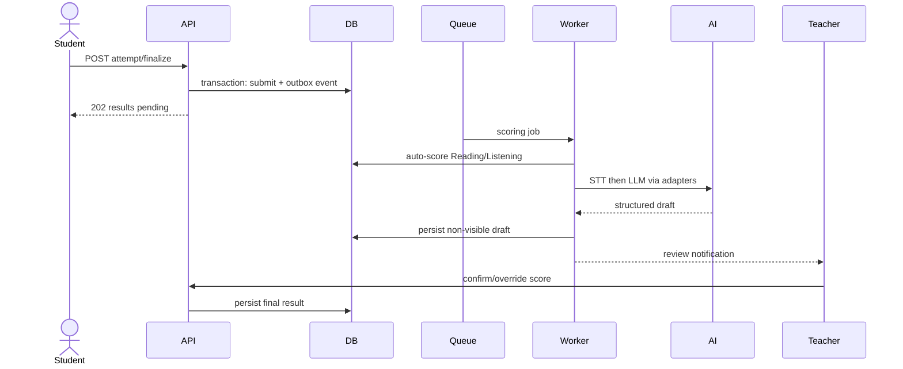
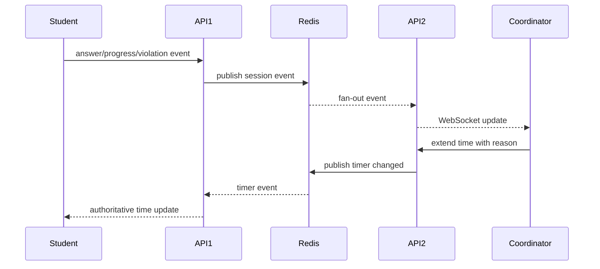
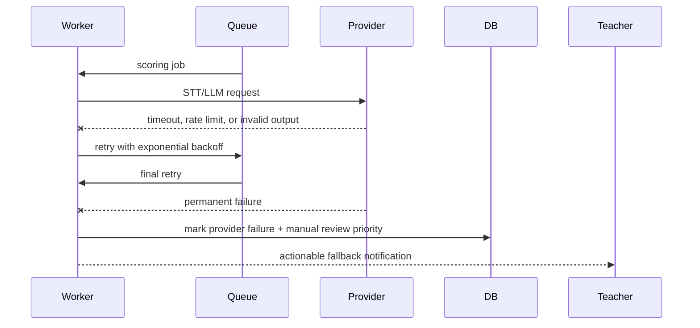

# Sequence Diagrams — APTIS LMS

## Sequence Diagrams

### Flow: Tenant-scoped login and refresh rotation

### Flow: Per-answer persistence with stale-write protection

### Flow: Disconnect and resume

### Flow: Submission and asynchronous scoring

### Flow: Live monitor across horizontally scaled API nodes

### Flow: Provider failure and manual-review fallback

