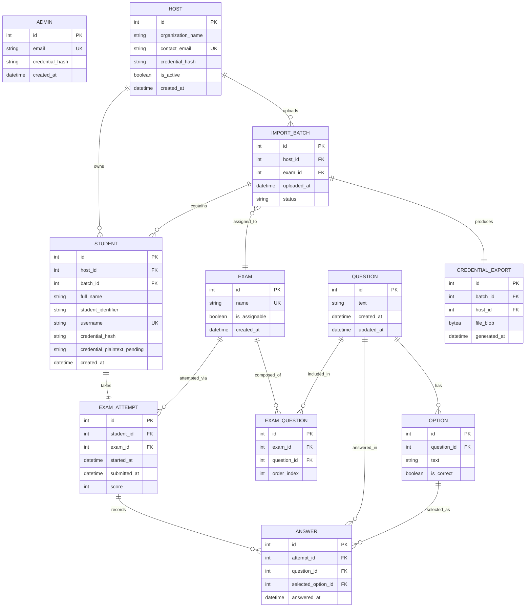

# Entity Relationship Diagram — APTIS MVP (Host-Driven Exam Distribution)

## Entity Relationship Diagram

## Entity Descriptions
| Entity | Description | Key Attributes | Relationships |
|---|---|---|---|
| ADMIN | Platform owner account | id, email, credential_hash | none (top-level actor) |
| HOST | A customer organization's manager account, created by Admin | id, organization_name, contact_email, is_active | has many STUDENT, has many IMPORT_BATCH |
| STUDENT | An auto-provisioned exam-taker account; `username` is generated as `{host_slug}-{student_identifier_or_email_local_part}` with a numeric suffix on collision, to stay globally unique even though BR-004 only requires uniqueness within a Host (see FLAG-TECHLEAD-001 in architecture.md); `credential_plaintext_pending` holds the one-time generated credential only until `CREDENTIAL_EXPORT` is generated, then is nulled in the same transaction (BR-001) | id, host_id, batch_id, student_identifier, username, credential_plaintext_pending | belongs to HOST, belongs to IMPORT_BATCH, has one EXAM_ATTEMPT |
| QUESTION | A reusable multiple-choice question authored by Admin | id, text | has many OPTION, included in many EXAM via EXAM_QUESTION |
| OPTION | One answer choice for a QUESTION; exactly one `is_correct = true` per question (validated at write time, not DB-enforced in MVP) | id, question_id, text, is_correct | belongs to QUESTION |
| EXAM | A named, ordered set of questions; `is_assignable` is true only when it has ≥1 question (BR-006) | id, name, is_assignable | has many EXAM_QUESTION, assigned to many IMPORT_BATCH |
| EXAM_QUESTION | Join entity ordering QUESTION within EXAM | id, exam_id, question_id, order_index | belongs to EXAM, belongs to QUESTION |
| IMPORT_BATCH | One Host roster-upload event; becomes assignable to an EXAM after validation | id, host_id, exam_id (nullable until assigned), status | belongs to HOST, has many STUDENT, has one CREDENTIAL_EXPORT |
| CREDENTIAL_EXPORT | The generated `.xlsx` blob containing usernames/credentials/exam name for one batch; the system of record for plaintext distribution (BR-008) — never regenerated from DB after creation | id, batch_id, host_id (denormalized for fast BR-008 check), file_blob | belongs to IMPORT_BATCH |
| EXAM_ATTEMPT | A Student's single allowed sitting of their assigned EXAM (BR-003, Assumption 4: exactly one per student) | id, student_id, exam_id, submitted_at, score | belongs to STUDENT, belongs to EXAM, has many ANSWER |
| ANSWER | One recorded answer for one question within one attempt; unanswered questions simply have no row (scored as incorrect, AC US-013) | id, attempt_id, question_id, selected_option_id (nullable) | belongs to EXAM_ATTEMPT, references QUESTION and OPTION |

## Indexes and Constraints
- `ADMIN.email` — UNIQUE
- `HOST.contact_email` — UNIQUE
- `STUDENT.username` — UNIQUE (global; see derivation rule above)
- `STUDENT (host_id, student_identifier)` — UNIQUE, enforces BR-004
- `STUDENT.host_id` — INDEX (every Host-scoped query filters on this, BR-005)
- `IMPORT_BATCH.host_id` — INDEX
- `EXAM.name` — UNIQUE, enforces AC US-004 duplicate-name rejection
- `EXAM_QUESTION (exam_id, question_id)` — UNIQUE
- `CREDENTIAL_EXPORT.batch_id` — UNIQUE (one export per batch)
- `CREDENTIAL_EXPORT.host_id` — INDEX, backs the BR-008 ownership check on every download request
- `EXAM_ATTEMPT.student_id` — UNIQUE, enforces Assumption 4 / BR-003 (exactly one attempt per student) at the DB layer, not just application logic
- `ANSWER (attempt_id, question_id)` — UNIQUE, prevents duplicate-answer rows for the same question within one attempt
- `QUESTION` deletion — blocked at the application layer (not a DB constraint) when referenced by any `EXAM_QUESTION` whose `EXAM` has ≥1 `IMPORT_BATCH` assignment, per BR-009
