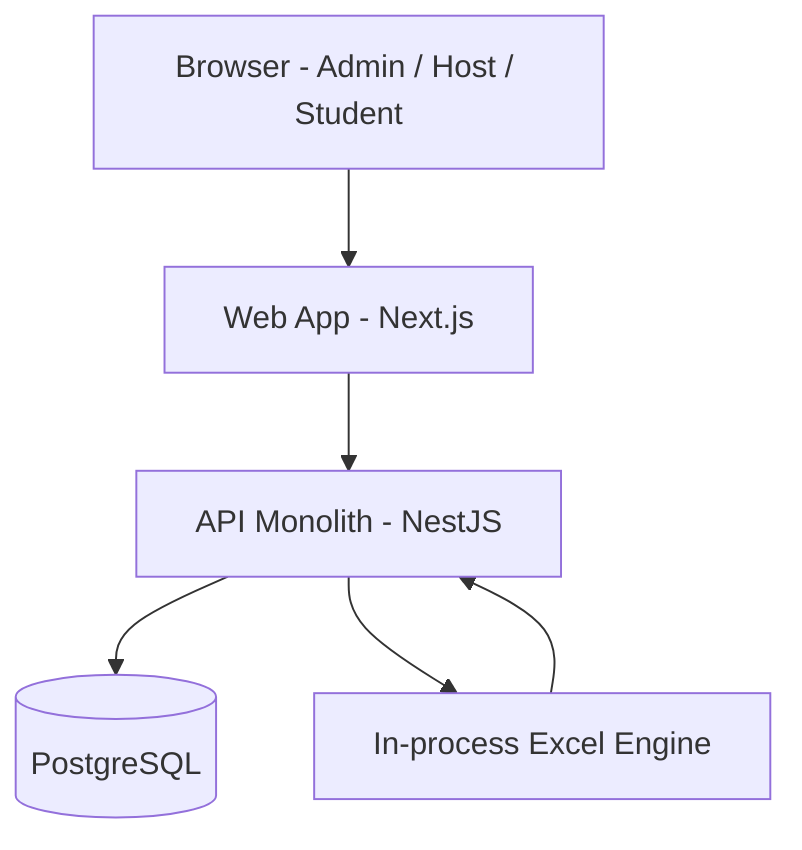
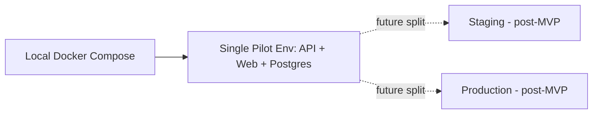

# System Architecture — APTIS MVP (Host-Driven Exam Distribution)

## Overview

APTIS MVP is delivered as a single deployable monolith: one NestJS API process backed by one PostgreSQL database, paired with one Next.js web client. This collapses what would eventually be several bounded contexts (content, tenancy, exam-taking) into one codebase organized as internal modules, because the BA scope is a single linear flow (Admin → Host → Student) and the implementation team is 4 full-stack generalists with 7 days. Multi-tenant isolation is enforced at the application layer (JWT-derived `hostId` on every Host/Student-scoped query) rather than via database Row-Level Security, per BA Assumption 5.

## Component Architecture

### Component Descriptions
| Component | Responsibility | Technology |
|---|---|---|
| Web App | Renders Admin/Host/Student UIs; calls API over REST/JSON; holds JWT in memory + httpOnly cookie | Next.js 14 (React, TypeScript) |
| API Monolith | Auth, question/exam CRUD, Host management, roster import + validation, exam-taking, scoring, credential export | NestJS 10 (Node.js, TypeScript) |
| PostgreSQL | System of record for all entities; enforces uniqueness/FK constraints backing BR-004, BR-005, BR-006, BR-009 | PostgreSQL 15 |
| Excel Engine | Parses uploaded `.xlsx` rosters; generates the credentials `.xlsx` export; runs in-process inside the same request, no separate worker | `exceljs` |

## Data Flow

1. **Admin → Host provisioning:** Admin submits Host org details → API generates a random Host credential, hashes it, persists `HOST`, returns plaintext once to Admin's response only (never re-served).
2. **Host → roster import:** Host uploads `.xlsx` → API parses rows in-process → validates per-row (required fields, BR-004 uniqueness within `host_id`) → creates `STUDENT` rows for valid entries only, generating a random credential per student and storing only its hash, with the plaintext held transiently in a `credential_plaintext_pending` column until consumed by export generation (see ADR-004 area in ADR-001/ADR-003 trade-off notes).
3. **Host → exam assignment + export:** Host selects an `EXAM` (must be assignable, BR-006) → API links the batch, regenerates the credentials workbook from the still-pending plaintext + assigned exam name, persists the workbook as a blob on `CREDENTIAL_EXPORT`, and nulls out every consumed `credential_plaintext_pending` value in the same transaction.
4. **Host → download:** Host requests the export; API checks `export.host_id == jwt.host_id` (BR-008) and streams the stored blob — never regenerated from DB, so plaintext is never reconstructed after the one-time generation step (BR-001).
5. **Student → exam-taking:** Student logs in with issued username/credential → answers are recorded per question as the student progresses → submit is rejected if an attempt is already submitted (BR-003) → scoring runs synchronously against `OPTION.is_correct` for multiple-choice only (BR-007) → score is shown immediately and is stable on later views.

## Deployment Model

Given the 7-day timeline, the MVP intentionally collapses the staging tier: a single hosted "Pilot" environment doubles as the staging check and the customer-facing deployment for week 1. This is a documented, deliberate gap — true Dev → Staging → Prod separation is the first hardening item if the MVP continues past the initial pilot.

- **Local Dev:** `docker-compose` with 3 services — `api` (NestJS, hot reload), `web` (Next.js dev server), `db` (`postgres:15`). One `.env` per service, no shared secrets file.
- **Pilot (staging+prod combined):** one managed Postgres instance + one API container + one Web container, deployed together as a single release. No blue/green, no autoscaling — out of scope for week 1.

## Security Architecture

- **Authentication:** stateless JWT (access token only, no refresh-token rotation in MVP), issued at login for all three roles. Credential hashing via bcrypt/argon2 (BR-001); generated Student/Host credentials are random ≥8-char alphanumeric strings (BR-002).
- **Authorization (RBAC):** three roles — `ADMIN`, `HOST`, `STUDENT` — enforced via a NestJS Guard reading the role claim from the JWT. Every Host- or Student-scoped repository call requires an explicit `hostId` argument sourced **only** from JWT claims, never from request body/params, enforcing BR-005 at the application layer (no DB RLS in MVP, per Assumption 5).
- **Encryption in transit:** TLS terminated at the hosting platform edge for both Web and API.
- **Encryption at rest:** managed Postgres disk encryption (provider-default); no plaintext credential ever reaches a persistent column outside the bounded `credential_plaintext_pending` window described above, which is cleared immediately after export generation.
- **Top 3 threats and mitigations:**
  1. *Cross-tenant data leak* (a missed `hostId` filter) — mitigated by routing all Host/Student data access through a single base-repository helper that mandates a `hostId` argument; flagged in ADR-003 as the highest residual MVP risk.
  2. *Credential-export endpoint exposure* — mitigated by BR-008 ownership check (`export.host_id == jwt.host_id`) and no public/guessable export URL.
  3. *Duplicate/replayed exam submission* — mitigated by BR-003's submit-once constraint enforced via a DB unique constraint on `EXAM_ATTEMPT.student_id` plus an idempotency check in the submit handler.

## Gate 1: Design Freeze

**Status:** DECLARED
**Date:** 2026-06-21
**Architecture baseline:** NestJS monolith (layered modules, not full DDD bounded contexts) + Next.js web client + single PostgreSQL instance via Prisma; synchronous in-process Excel import/export; stateless JWT auth with app-layer `hostId` scoping; single combined Pilot deployment environment.
**Change protocol:** Any change to this baseline (e.g., introducing a queue/worker, splitting services, adding DB RLS) requires a new ADR before implementation begins.
**Baseline amended by ADR-005 (2026-06-21):** the MVP is built as the first vertical slice of the production `aptis-lms` repos (full DDD bounded contexts, apps/api-only, worker/Redis/RLS deferred-but-planned). This `architecture.md` describes the original from-scratch simplified plan; read **ADR-005 + mvp-slice-mapping.md** for the architecture actually in force.

## Flags from Previous Agents

### FLAG-TECHLEAD-001
**Severity:** Major
**Source artifact:** `team/ba/business-rules.md` (BR-004) and `team/ba/user-stories.md` (US-011 / REQ-13)
**Issue:** BR-004 only requires a student identifier (code/email) to be unique *within a Host's organization*. REQ-13/US-011 implies Student login resolves a single global `username`. If two different Hosts each import a student using the same code (e.g., both upload a row with code "S001"), a naive `username = student_identifier` scheme would collide across tenants.
**Suggestion:** Resolved at TechLead level — generate `STUDENT.username` as `{host_slug}-{student_identifier_or_email_local_part}`, with a numeric suffix appended on any residual collision. See `ERD.md` entity description for `STUDENT`. No BA artifact change needed; this is purely a derivation rule.
