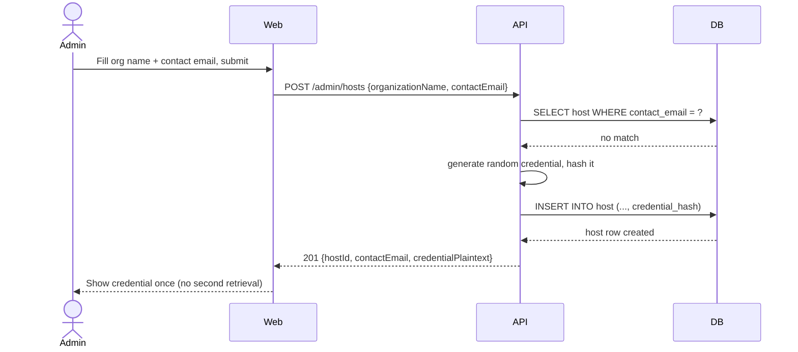
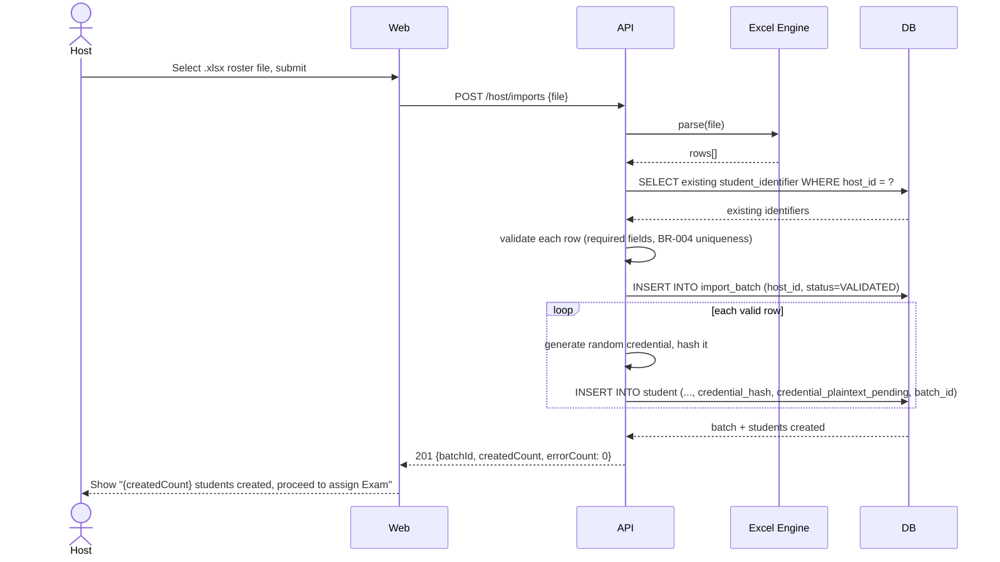
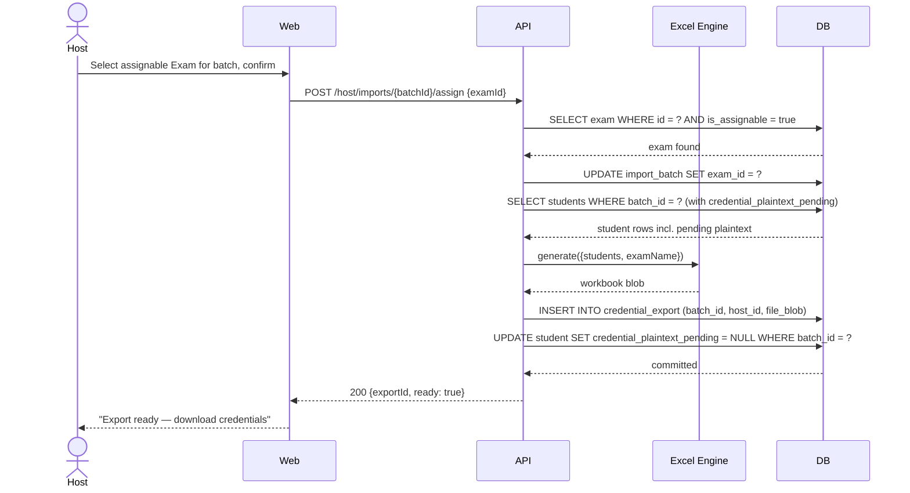
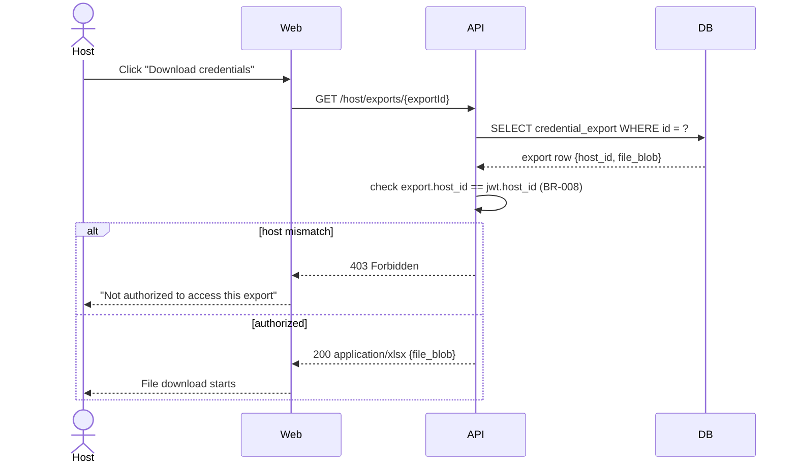
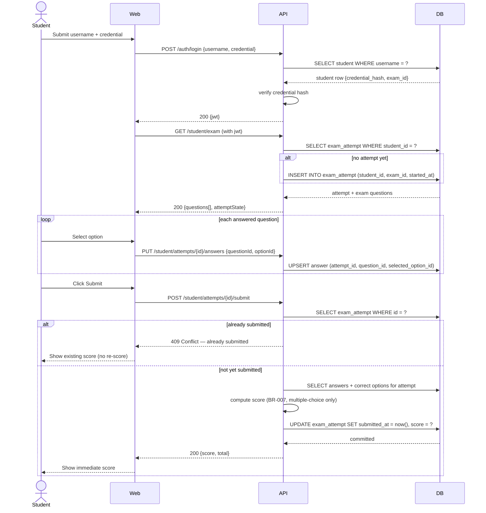

# Sequence Diagrams — APTIS MVP (Host-Driven Exam Distribution)

## Sequence Diagrams

### Flow 1: Admin creates a Host account (happy path)



### Flow 2: Host uploads student roster — happy path



### Flow 3: Host uploads student roster — error path (invalid/duplicate rows)

```mermaid
sequenceDiagram
    actor Host
    participant Web
    participant API
    participant XL as Excel Engine
    participant DB

    Host->>Web: Select .xlsx roster file, submit
    Web->>API: POST /host/imports {file}
    API->>XL: parse(file)
    XL-->>API: rows[]
    API->>DB: SELECT existing student_identifier WHERE host_id = ?
    DB-->>API: existing identifiers
    API->>API: validate each row
    Note over API: Row 3 missing full_name; Row 7 duplicates existing identifier
    API->>DB: INSERT INTO import_batch (host_id, status=PARTIAL)
    loop each valid row only
        API->>DB: INSERT INTO student (...)
    end
    API-->>Web: 201 {batchId, createdCount, errors: [{row:3, reason:"missing full_name"}, {row:7, reason:"duplicate identifier"}]}
    Web-->>Host: Show validation report — valid rows created, invalid rows listed with reasons
```

### Flow 4: Host assigns an Exam to a batch and generates the credential export



### Flow 5: Host downloads the credential export



### Flow 6: Student logs in, answers questions, submits, and views score


