# PTE Prep — Hướng dẫn vẽ ERD cho SRS

**Mục đích:** Hướng dẫn tạo Entity Relationship Diagram (ERD) cho Software
Requirement Specification của PTE Prep.

**Ngày cập nhật:** 2026-09-29  
**Phạm vi:** Mô hình dữ liệu nghiệp vụ và các dữ liệu hỗ trợ trực tiếp cho các
chức năng đã được chốt trong SRS.

---

## 1. ERD trong SRS dùng để làm gì?

ERD trong SRS dùng để trả lời bốn câu hỏi:

1. Hệ thống cần lưu những thông tin nghiệp vụ nào?
2. Các thông tin đó liên kết với nhau như thế nào?
3. Ai hoặc tổ chức nào sở hữu, tạo và thay đổi dữ liệu?
4. Dữ liệu nào cần được giữ nguyên để có thể truy lại lịch sử kỳ thi, bài làm,
   điểm và báo cáo?

ERD của SRS không cần mô tả mọi class Java hoặc mọi bảng kỹ thuật của hệ thống.
ERD cần đủ chi tiết để người đọc có thể đối chiếu với:

- Functional Requirements;
- Business Rules;
- actor và quyền truy cập;
- luồng tạo kỳ thi, làm bài, chấm điểm và công bố kết quả;
- yêu cầu audit, bảo mật và lưu dữ liệu.

---

## 2. Vị trí ERD trong tài liệu SRS

Trong template SRS, đặt ERD tại:

```text
3. Functional Requirements
└── 3.1 System Functional Overview
    └── 3.1.5 Entity Relationship Diagram
```

Nên sử dụng cấu trúc sau:

1. **ERD Overview:** sơ đồ tổng quan toàn bộ các nhóm dữ liệu.
2. **Identity and Organization ERD:** tài khoản, tổ chức, chương trình, lớp.
3. **Content and Scoring Template ERD:** câu hỏi, media, mẫu tính điểm.
4. **Billing ERD:** gói, đơn hàng, thanh toán, license và subscription.
5. **Exam and Delivery ERD:** kỳ thi, đề cố định, form, enrollment, attempt,
   answer.
6. **Proctoring, Scoring and Reporting ERD:** giám sát, Examiner, điểm,
   báo cáo, audit và notification.
7. **Entity Dictionary:** mô tả entity, khóa chính, khóa ngoại và mục đích.

Một ERD tổng quan duy nhất thường quá lớn và khó đọc. Việc tách thành các
sub-diagram vẫn là cùng một mô hình dữ liệu; mỗi sub-diagram chỉ phóng to một
nhóm nghiệp vụ.

ERD Overview bên dưới tập trung vào các entity Core. Các entity Detail như
`RefreshToken`, `ExamGenerationJob`, `QuotaTransaction` và cấu hình runtime có
thể đặt ở sub-diagram hoặc Entity Dictionary mà không làm hình tổng quan quá
chật.

---

## 3. Phạm vi actor và cách thể hiện trong ERD

PTE Prep có sáu human role:

- `Platform Admin`
- `Platform Author`
- `Host`
- `Proctor`
- `Examiner`
- `Student`

Các role này không nên được vẽ thành sáu entity riêng. Hãy dùng:

```text
User ─── UserRole ─── Role
```

`External Integration Services` cũng không phải là user role và không nên là
bảng dữ liệu nội bộ. PayOS, Cloudinary, AI Scoring Provider và Email Service
nên được vẽ ở Context Diagram hoặc Integration Diagram, bên ngoài biên PTE
Prep.

### 3.1. Quy tắc về người dùng

| Cách làm | Quyết định |
|---|---|
| Tạo bảng Host, Proctor, Examiner, Student riêng | Không dùng trong ERD nghiệp vụ |
| Dùng một bảng `User` và bảng liên kết `UserRole` | Dùng |
| Tạo bảng `Lecturer` hoặc `ProgramCoordinator` | Không dùng; chưa nằm trong actor model đã chốt |
| Lưu External Service như một user | Không dùng |
| Student profile | Có thể biểu diễn bằng `User` có role `Student`; chỉ tách bảng riêng nếu có yêu cầu dữ liệu riêng được duyệt |

---

## 4. Quy ước vẽ

### 4.1. Khóa và thuộc tính

Mỗi entity nên có tối thiểu:

| Ký hiệu | Ý nghĩa |
|---|---|
| `PK` | Khóa chính |
| `FK` | Khóa ngoại |
| `UK` | Giá trị duy nhất |
| `NN` | Không được để trống |
| `status` | Trạng thái vòng đời của dữ liệu |
| `created_at`, `updated_at` | Thời điểm tạo và cập nhật |

Các entity dùng cho tổ chức nên có `tenant_id` hoặc quan hệ đến
`Tenant/Organization`, trừ dữ liệu dùng chung toàn nền tảng như `Plan`,
`QuestionType` hoặc `ScoreTemplate`.

### 4.2. Cardinality

| Ký hiệu | Cách hiểu |
|---|---|
| `1` | Một và chỉ một |
| `0..1` | Không có hoặc có một |
| `1..N` | Một hoặc nhiều |
| `0..N` | Không có hoặc có nhiều |
| `N..N` | Nhiều-nhiều; phải có bảng liên kết |

Ví dụ:

```text
Organization 1 ─── N Program
Program 1 ─── N StudentClass
StudentClass N ─── N Student
```

Quan hệ nhiều-nhiều phải được chuyển thành entity trung gian:

```text
StudentClass 1 ─── N ClassMembership N ─── 1 User(Student)
```

### 4.3. Tên entity

Trong phần nghiệp vụ của SRS dùng tên dễ hiểu. Có thể ghi tên kỹ thuật trong
ngoặc:

| Tên nghiệp vụ | Tên kỹ thuật hiện có |
|---|---|
| Organization | `Tenant` / `Organization` |
| Exam | `ExamSession` |
| Student attempt | `ExamAttempt` |
| Fixed exam version | `ExamSnapshot` |
| Exam question | `SnapshotItem` hoặc `PinnedItem` tùy giai đoạn |
| Student answer | `AttemptAnswer` |
| Score Template | `ScoreTemplate` |

Không dùng tên class kỹ thuật mà không giải thích ý nghĩa nghiệp vụ.

---

## 5. Danh sách entity cần có

Phần này là checklist chính khi vẽ ERD. Các entity đánh dấu **Core** nên xuất
hiện trong ERD tổng quan. Các entity đánh dấu **Detail** có thể đặt trong
sub-diagram hoặc phụ lục kỹ thuật.

### 5.1. Identity và Organization

| Entity | Mức độ | Mục đích |
|---|---|---|
| `Tenant` | Core | Biên dữ liệu của một tổ chức sử dụng nền tảng |
| `Organization` | Core | Thông tin nhận diện, tên, loại hình và trạng thái tổ chức |
| `TenantApplication` | Detail | Hồ sơ đăng ký tổ chức trước khi được duyệt |
| `User` | Core | Tài khoản của sáu human role |
| `UserRole` | Core | Liên kết User với Role |
| `Role` | Core | Sáu role đã được phê duyệt |
| `RefreshToken` | Detail | Phiên gia hạn đăng nhập |
| `LoginCredential` | Detail | Thông tin xác thực được bảo vệ; không ghi mật khẩu thật vào ERD hoặc tài liệu |

Quan hệ cần vẽ:

```text
Tenant 1 ─── N Organization
Tenant 1 ─── N User
User N ─── N Role thông qua UserRole
User 1 ─── N RefreshToken
TenantApplication 0..1 ─── 0..1 Tenant sau khi được duyệt
```

Ghi chú: Trong source hiện tại có `Tenant` và `Organization`. Nếu ERD mô tả
database hiện tại, giữ cả hai. Nếu ERD mô tả nghiệp vụ cho BA, có thể chú thích
chúng cùng thuộc khái niệm **Organization**.

### 5.2. Program, Class và Student

| Entity | Mức độ | Mục đích |
|---|---|---|
| `Program` | Core | Chương trình đào tạo hoặc nhóm học tập |
| `StudentClass` | Core | Lớp thuộc một chương trình |
| `ClassMembership` | Core | Liên kết Student với lớp |
| `ClassStaffAssignment` | Detail | Liên kết nhân sự được giao cho lớp; dùng User, không tạo role mới |

Quan hệ:

```text
Organization 1 ─── N Program
Program 1 ─── N StudentClass
StudentClass 1 ─── N ClassMembership
User(Student) 1 ─── N ClassMembership
StudentClass 1 ─── N ClassStaffAssignment
User 1 ─── N ClassStaffAssignment
```

### 5.3. Question Bank và Media

| Entity | Mức độ | Mục đích |
|---|---|---|
| `QuestionTypeDefinition` | Core | Catalog loại task PTE và yêu cầu dữ liệu của task |
| `Question` | Core | Nội dung câu hỏi, revision và trạng thái duyệt |
| `QuestionOption` | Core | Các lựa chọn, đáp án đúng và thứ tự lựa chọn |
| `MediaObject` | Core | Audio hoặc image của câu hỏi |
| `TaskRuntimeProfile` | Detail | Cấu hình hành vi chạy task |
| `TaskRuntimeContract` | Detail | Hợp đồng dữ liệu giữa task và exam client |
| `TaskTypePublicationUsage` | Detail | Lịch sử việc task type được dùng trong nội dung đã publish |

Quan hệ:

```text
QuestionTypeDefinition 1 ─── N Question
Question 1 ─── N QuestionOption
Question 0..N ─── MediaObject
Question 1 ─── N QuestionRevision
```

Revision có thể vẽ theo một trong hai cách:

1. Dùng entity riêng `QuestionRevision`.
2. Dùng quan hệ tự tham chiếu trong `Question` với `revision_group_id`,
   `revision_number` và `supersedes_question_id`.

Trong source hiện tại, revision đang được biểu diễn trong cùng nhóm
`Question`. Khi vẽ ERD nghiệp vụ, nên ghi chú rõ rằng bản đã dùng trong Exam
không bị thay đổi khi bản nháp mới được tạo.

### 5.4. Score Template

| Entity | Mức độ | Mục đích |
|---|---|---|
| `ScoreTemplate` | Core | Mẫu tính điểm được duyệt và kích hoạt |
| `ScoreTemplateItem` | Core | Loại task, số lượng, thời gian, trọng số và phương pháp chấm |

Quan hệ:

```text
ScoreTemplate 1 ─── N ScoreTemplateItem
QuestionTypeDefinition 1 ─── N ScoreTemplateItem
```

Score Template phải có version hoặc mã phiên bản. Exam đã khóa phải giữ được
version đã dùng tại thời điểm tạo đề.

### 5.5. Package và Payment

| Entity | Mức độ | Mục đích |
|---|---|---|
| `Plan` | Core | Gói sản phẩm do Platform Admin quản lý |
| `Order` | Core | Đơn hàng của Organization |
| `PaymentTransaction` | Detail | Callback và trạng thái xử lý thanh toán |
| `LicenseCode` | Core | Mã cấp quyền sử dụng gói |
| `Subscription` | Core | Quyền sử dụng gói của Organization trong một thời hạn |
| `QuotaTransaction` | Detail | Lịch sử tăng, giảm hoặc sử dụng hạn mức |
| `PlatformSetting` | Detail | Cấu hình dùng chung của nền tảng |

Quan hệ:

```text
Plan 1 ─── N Order
Plan 1 ─── N LicenseCode
Plan 1 ─── N Subscription
Organization 1 ─── N Order
Organization 1 ─── N Subscription
Order 1 ─── N PaymentTransaction
LicenseCode 0..1 ─── 1 Subscription
Organization 1 ─── N QuotaTransaction
```

`PaymentTransaction` cần có khóa hoặc mã chống xử lý callback trùng. Dữ liệu
thẻ gốc không thuộc phạm vi lưu trữ của PTE Prep.

### 5.6. Exam setup và fixed content

| Entity | Mức độ | Mục đích |
|---|---|---|
| `ExamSession` | Core | Một kỳ thi hoặc exam sitting |
| `ExamPolicy` | Core | Chính sách replay, device check, proctor và lockdown |
| `ExamBlueprint` | Core | Bản nháp cấu trúc đề |
| `BlueprintItem` | Core | Câu hỏi được chọn vào blueprint |
| `ExamSnapshot` | Core | Bản nội dung đã cố định cho kỳ thi |
| `SnapshotItem` | Core | Bản sao bất biến của câu hỏi trong snapshot |
| `ExamAudienceSource` | Detail | Nguồn tạo danh sách Student: User, Class hoặc Program |
| `ExamAudienceMember` | Core | Kết quả kiểm tra danh sách Student trước khi publish |
| `Enrollment` | Core | Student chính thức được ghi danh vào Exam |
| `SessionClassAssignment` | Detail | Lớp được gắn vào Exam |
| `ExamGenerationJob` | Detail | Trạng thái tiến trình tạo form/đề |
| `ExamForm` | Core | Một form đề được tạo từ snapshot |
| `FormAssignment` | Core | Gán form cho từng Student |

Quan hệ:

```text
Organization 1 ─── N ExamSession
Subscription 1 ─── N ExamSession
ScoreTemplate 1 ─── N ExamSession

ExamBlueprint 1 ─── N BlueprintItem
Question 1 ─── N BlueprintItem

ExamSnapshot 1 ─── N SnapshotItem
Question 1 ─── N SnapshotItem
ExamSession 0..1 ─── 1 ExamSnapshot

ExamSession 1 ─── N ExamAudienceSource
ExamSession 1 ─── N ExamAudienceMember
ExamSession 1 ─── N Enrollment
ExamSession 1 ─── N ExamGenerationJob
ExamSession 1 ─── N ExamForm
ExamForm 1 ─── N FormAssignment
User(Student) 1 ─── N FormAssignment
```

`ExamAudienceMember` và `Enrollment` không nên tự động gộp khi vẽ ERD kỹ thuật:

- `ExamAudienceMember` thể hiện danh sách đã được xem xét, loại trùng và kiểm
  tra điều kiện.
- `Enrollment` thể hiện Student chính thức được ghi danh sau khi Exam được
  publish.

### 5.7. Student Attempt và Answer

| Entity | Mức độ | Mục đích |
|---|---|---|
| `ExamAttempt` | Core | Một lượt Student làm một Exam |
| `PinnedExamSnapshot` | Core | Bản snapshot được khóa cho Attempt |
| `PinnedItem` | Core | Câu hỏi bất biến mà Attempt thực sự sử dụng |
| `AttemptAnswer` | Core | Câu trả lời của Student |
| `AttemptHeartbeat` | Detail | Trạng thái kết nối và hoạt động của Attempt |
| `AttemptSecurityEvent` | Core | Sự kiện bảo vệ hoặc vi phạm từ exam client |

Quan hệ:

```text
ExamSession 1 ─── N ExamAttempt
User(Student) 1 ─── N ExamAttempt
Enrollment 1 ─── 0..N ExamAttempt

ExamAttempt 1 ─── 0..1 PinnedExamSnapshot
PinnedExamSnapshot 1 ─── N PinnedItem
ExamAttempt 1 ─── N AttemptAnswer
PinnedItem 1 ─── N AttemptAnswer

ExamAttempt 1 ─── 0..1 AttemptHeartbeat
ExamAttempt 1 ─── N AttemptSecurityEvent
```

Chuỗi bảo toàn nội dung phải được nhìn thấy trong ERD:

```text
Question
  → SnapshotItem
  → PinnedItem
  → AttemptAnswer
```

Chuỗi này giải thích Business Rule: câu hỏi đã dùng trong một Exam không bị
thay đổi chỉ vì Platform Author tạo revision mới.

### 5.8. Proctoring

| Entity | Mức độ | Mục đích |
|---|---|---|
| `ProctorAssignment` | Core | Gán Proctor cho Exam |
| `ProctorSession` | Core | Phiên giám sát của Proctor |
| `ViolationEvent` | Core | Vi phạm hoặc sự kiện được Proctor ghi nhận |

Quan hệ:

```text
ExamSession 1 ─── N ProctorAssignment
User(Proctor) 1 ─── N ProctorAssignment
ExamSession 1 ─── N ProctorSession
User(Proctor) 1 ─── N ProctorSession
ProctorSession 1 ─── N ViolationEvent
ExamAttempt 1 ─── N ViolationEvent theo attempt_public_id
```

`AttemptSecurityEvent` là sự kiện từ exam client. `ViolationEvent` là sự kiện
được ghi nhận trong nghiệp vụ giám sát. Có thể liên kết chúng bằng
`attempt_public_id`, nhưng không nên coi chúng là cùng một entity.

### 5.9. Scoring và Report

| Entity | Mức độ | Mục đích |
|---|---|---|
| `ScoringAnswer` | Core | Trạng thái chấm của một câu trả lời |
| `ExaminerAssignmentBatch` | Core | Một đợt phân bài cho Examiner |
| `ExaminerAttemptAssignment` | Core | Gán Attempt cho Examiner |
| `ExaminerAnswerScore` | Core | Điểm do Examiner gửi |
| `ScoreSourceAudit` | Core | Lịch sử Host chọn nguồn điểm |
| `ScoringSessionState` | Detail | Trạng thái khóa và công bố điểm của Exam |
| `AttemptReport` | Core | Báo cáo kết quả của Student |

Quan hệ:

```text
ExaminerAssignmentBatch 1 ─── N ExaminerAttemptAssignment
ExamAttempt 1 ─── N ExaminerAttemptAssignment
User(Examiner) 1 ─── N ExaminerAttemptAssignment

AttemptAnswer 1 ─── N ExaminerAnswerScore
User(Examiner) 1 ─── N ExaminerAnswerScore
ExamAttempt 1 ─── N ScoringAnswer
ExamSession 1 ─── N ScoreSourceAudit
User(Host) 1 ─── N ScoreSourceAudit

ExamAttempt 1 ─── 0..1 AttemptReport
```

Trong source hiện tại, một số quan hệ scoring được lưu bằng UUID thay vì JPA
foreign key. Trong ERD SRS vẫn nên vẽ quan hệ logic và ghi chú:

```text
ScoringAnswer.answer_public_id → AttemptAnswer.public_id
ExaminerAnswerScore.answer_public_id → AttemptAnswer.public_id
```

### 5.10. Audit và Notification

| Entity | Mức độ | Mục đích |
|---|---|---|
| `AuditLog` | Core | Lịch sử thao tác quan trọng |
| `NotificationLog` | Core | Trạng thái tạo và gửi thông báo |

Quan hệ:

```text
User 1 ─── N AuditLog
Tenant 1 ─── N AuditLog
User 1 ─── N NotificationLog
Tenant 1 ─── N NotificationLog
```

`AuditLog` thường dùng `aggregate_type` và `aggregate_id` để trỏ đến nhiều
loại dữ liệu. Đây là quan hệ đa hình; ghi chú trong ERD thay vì tạo foreign key
đến mọi entity.

---

## 6. External Services trong ERD

Không tạo bảng `PayOS`, `Cloudinary`, `AIProvider` hoặc `EmailService` trong
database ERD của PTE Prep.

Hãy thể hiện chúng bằng ghi chú ngoài biên hệ thống:

```text
PayOS
  → Order / PaymentTransaction

Cloudinary
  → MediaObject

AI Scoring Provider
  → ScoringAnswer

Email / Notification Service
  → NotificationLog
```

Nếu cần vẽ đường kết nối, dùng đường nét đứt và ghi rõ đó là **external
integration**, không phải foreign key.

Redis và RabbitMQ cũng không phải entity của ERD nghiệp vụ. Chỉ mô tả chúng ở
phần kiến trúc hoặc non-functional requirements.

---

## 7. Mermaid ERD tổng quan để tham khảo

Đoạn dưới đây là khung tham khảo. Có thể dùng trên Mermaid Live Editor,
Mermaid-compatible Markdown hoặc chuyển thành draw.io. Không cần đưa toàn bộ
thuộc tính kỹ thuật vào hình tổng quan.

```mermaid
erDiagram
    TENANT ||--o{ ORGANIZATION : contains
    TENANT ||--o{ USER_ACCOUNT : scopes
    USER_ACCOUNT ||--o{ USER_ROLE : has
    ROLE ||--o{ USER_ROLE : grants

    TENANT ||--o{ PROGRAM : owns
    PROGRAM ||--o{ STUDENT_CLASS : contains
    STUDENT_CLASS ||--o{ CLASS_MEMBERSHIP : has
    USER_ACCOUNT ||--o{ CLASS_MEMBERSHIP : joins

    TASK_TYPE ||--o{ QUESTION : classifies
    QUESTION ||--o{ QUESTION_OPTION : contains
    QUESTION ||--o{ MEDIA_OBJECT : uses
    SCORE_TEMPLATE ||--o{ SCORE_TEMPLATE_ITEM : contains
    TASK_TYPE ||--o{ SCORE_TEMPLATE_ITEM : defines

    PLAN ||--o{ PAYMENT_ORDER : selected_for
    PLAN ||--o{ LICENSE_CODE : issues
    PLAN ||--o{ SUBSCRIPTION : activates
    TENANT ||--o{ PAYMENT_ORDER : places
    PAYMENT_ORDER ||--o{ PAYMENT_TRANSACTION : records
    TENANT ||--o{ SUBSCRIPTION : owns
    LICENSE_CODE o|--o| SUBSCRIPTION : redeems_to

    TENANT ||--o{ EXAM_SESSION : creates
    SUBSCRIPTION ||--o{ EXAM_SESSION : authorizes
    SCORE_TEMPLATE ||--o{ EXAM_SESSION : configures
    EXAM_BLUEPRINT ||--o{ BLUEPRINT_ITEM : contains
    QUESTION ||--o{ BLUEPRINT_ITEM : selected_as
    EXAM_SNAPSHOT ||--o{ SNAPSHOT_ITEM : freezes
    QUESTION ||--o{ SNAPSHOT_ITEM : copied_from
    EXAM_SESSION o|--o| EXAM_SNAPSHOT : uses
    EXAM_SESSION ||--o{ EXAM_AUDIENCE_MEMBER : reviews
    EXAM_SESSION ||--o{ ENROLLMENT : enrolls
    USER_ACCOUNT ||--o{ ENROLLMENT : attends
    EXAM_SESSION ||--o{ EXAM_FORM : generates
    EXAM_SNAPSHOT ||--o{ EXAM_FORM : supplies
    EXAM_FORM ||--o{ FORM_ASSIGNMENT : assigns
    USER_ACCOUNT ||--o{ FORM_ASSIGNMENT : receives

    EXAM_SESSION ||--o{ EXAM_ATTEMPT : has
    USER_ACCOUNT ||--o{ EXAM_ATTEMPT : makes
    ENROLLMENT ||--o{ EXAM_ATTEMPT : permits
    EXAM_ATTEMPT o|--o| PINNED_EXAM_SNAPSHOT : pins
    PINNED_EXAM_SNAPSHOT ||--o{ PINNED_ITEM : contains
    EXAM_ATTEMPT ||--o{ ATTEMPT_ANSWER : submits
    PINNED_ITEM ||--o{ ATTEMPT_ANSWER : answers
    EXAM_ATTEMPT o|--o| ATTEMPT_HEARTBEAT : tracks
    EXAM_ATTEMPT ||--o{ ATTEMPT_SECURITY_EVENT : emits

    EXAM_SESSION ||--o{ PROCTOR_ASSIGNMENT : assigns
    USER_ACCOUNT ||--o{ PROCTOR_ASSIGNMENT : serves_as_proctor
    EXAM_SESSION ||--o{ PROCTOR_SESSION : monitors
    USER_ACCOUNT ||--o{ PROCTOR_SESSION : serves_as_proctor
    PROCTOR_SESSION ||--o{ VIOLATION_EVENT : records

    EXAMINER_ASSIGNMENT_BATCH ||--o{ EXAMINER_ATTEMPT_ASSIGNMENT : contains
    EXAM_ATTEMPT ||--o{ EXAMINER_ATTEMPT_ASSIGNMENT : assigned
    USER_ACCOUNT ||--o{ EXAMINER_ATTEMPT_ASSIGNMENT : scores
    ATTEMPT_ANSWER ||--o{ EXAMINER_ANSWER_SCORE : receives
    EXAM_ATTEMPT ||--o{ SCORING_ANSWER : scores
    EXAM_SESSION ||--o{ SCORE_SOURCE_AUDIT : records
    EXAM_ATTEMPT ||--o| ATTEMPT_REPORT : publishes

    USER_ACCOUNT ||--o{ AUDIT_LOG : performs
    TENANT ||--o{ AUDIT_LOG : owns
    USER_ACCOUNT ||--o{ NOTIFICATION_LOG : receives
    TENANT ||--o{ NOTIFICATION_LOG : scopes

    TENANT {
        uuid public_id PK
        string code UK
        string name
        string status
    }
    ORGANIZATION {
        uuid public_id PK
        uuid tenant_id FK
        string name
        string status
    }
    USER_ACCOUNT {
        uuid public_id PK
        uuid tenant_id FK
        string username UK
        string status
    }
    ROLE {
        string code PK
        string display_name
    }
    USER_ROLE {
        uuid user_id FK
        string role_code FK
    }
    PROGRAM {
        uuid public_id PK
        uuid organization_id FK
        string name
        string status
    }
    STUDENT_CLASS {
        uuid public_id PK
        uuid program_id FK
        string name
        string status
    }
    CLASS_MEMBERSHIP {
        uuid public_id PK
        uuid class_id FK
        uuid student_id FK
        uuid tenant_id FK
    }
    TASK_TYPE {
        uuid public_id PK
        string code UK
        string section
        boolean scored
    }
    QUESTION {
        uuid public_id PK
        uuid tenant_id FK
        string revision_group_id
        int revision_number
        string status
        string title
    }
    QUESTION_OPTION {
        uuid public_id PK
        uuid question_id FK
        string text
        boolean correct
        int order_index
    }
    MEDIA_OBJECT {
        uuid public_id PK
        uuid tenant_id FK
        string content_type
        string status
        string storage_key UK
    }
    SCORE_TEMPLATE {
        uuid public_id PK
        string code
        int version
        string status
    }
    SCORE_TEMPLATE_ITEM {
        uuid public_id PK
        uuid template_id FK
        string task_type_code FK
        decimal overall_weight
        string scoring_method
    }
    PLAN {
        uuid public_id PK
        string name
        string type
        string status
    }
    PAYMENT_ORDER {
        uuid public_id PK
        uuid tenant_id FK
        uuid plan_id FK
        string status
        decimal amount
    }
    PAYMENT_TRANSACTION {
        uuid public_id PK
        uuid order_id FK
        string callback_reference UK
        boolean processed
    }
    LICENSE_CODE {
        uuid public_id PK
        uuid plan_id FK
        uuid subscription_id FK
        string status
    }
    SUBSCRIPTION {
        uuid public_id PK
        uuid tenant_id FK
        uuid plan_id FK
        string license_key UK
        datetime starts_at
        datetime expires_at
        string status
    }
    EXAM_SESSION {
        uuid public_id PK
        uuid tenant_id FK
        uuid subscription_id FK
        uuid score_template_id FK
        uuid snapshot_id FK
        datetime opens_at
        datetime closes_at
        string status
    }
    EXAM_BLUEPRINT {
        uuid public_id PK
        uuid tenant_id FK
        string name
        string status
        int version
    }
    BLUEPRINT_ITEM {
        uuid public_id PK
        uuid blueprint_id FK
        uuid question_id FK
        int order_index
    }
    EXAM_SNAPSHOT {
        uuid public_id PK
        uuid source_blueprint_id FK
        uuid score_template_id FK
        int version
        string status
    }
    SNAPSHOT_ITEM {
        uuid public_id PK
        uuid snapshot_id FK
        uuid source_question_id FK
        int order_index
    }
    EXAM_AUDIENCE_MEMBER {
        uuid public_id PK
        uuid session_id FK
        uuid student_id FK
        string status
        string reason
    }
    ENROLLMENT {
        uuid public_id PK
        uuid session_id FK
        uuid student_id FK
        string license_key
    }
    EXAM_FORM {
        uuid public_id PK
        uuid session_id FK
        uuid snapshot_id FK
        int form_index
    }
    FORM_ASSIGNMENT {
        uuid public_id PK
        uuid session_id FK
        uuid form_id FK
        uuid student_id FK
    }
    EXAM_ATTEMPT {
        uuid public_id PK
        uuid session_id FK
        uuid student_id FK
        string status
        datetime started_at
        datetime submitted_at
    }
    PINNED_EXAM_SNAPSHOT {
        uuid public_id PK
        uuid attempt_id FK
        uuid source_snapshot_id FK
        string exam_mode
    }
    PINNED_ITEM {
        uuid public_id PK
        uuid pinned_snapshot_id FK
        int order_index
        string task_type
    }
    ATTEMPT_ANSWER {
        uuid public_id PK
        uuid attempt_id FK
        uuid pinned_item_id FK
        string status
        text payload
    }
    ATTEMPT_HEARTBEAT {
        uuid public_id PK
        uuid attempt_id FK
        datetime last_seen_at
    }
    ATTEMPT_SECURITY_EVENT {
        uuid public_id PK
        uuid attempt_id FK
        string violation_type
        string severity
        datetime detected_at
    }
    PROCTOR_ASSIGNMENT {
        uuid public_id PK
        uuid session_id FK
        uuid proctor_id FK
        string role
    }
    PROCTOR_SESSION {
        uuid public_id PK
        uuid session_id FK
        uuid proctor_id FK
        string status
    }
    VIOLATION_EVENT {
        uuid public_id PK
        uuid proctor_session_id FK
        uuid attempt_id FK
        string violation_type
        datetime detected_at
    }
    EXAMINER_ASSIGNMENT_BATCH {
        uuid public_id PK
        uuid session_id FK
        uuid created_by_id FK
        string status
    }
    EXAMINER_ATTEMPT_ASSIGNMENT {
        uuid public_id PK
        uuid batch_id FK
        uuid attempt_id FK
        uuid examiner_id FK
    }
    EXAMINER_ANSWER_SCORE {
        uuid public_id PK
        uuid answer_id FK
        uuid examiner_id FK
        int score
        string status
    }
    SCORING_ANSWER {
        uuid public_id PK
        uuid answer_id FK
        uuid attempt_id FK
        string status
        string selected_source
    }
    SCORE_SOURCE_AUDIT {
        uuid public_id PK
        uuid session_id FK
        uuid actor_id FK
        string selected_source
        datetime occurred_at
    }
    ATTEMPT_REPORT {
        uuid public_id PK
        uuid attempt_id FK
        boolean published
        datetime published_at
    }
    AUDIT_LOG {
        uuid public_id PK
        uuid tenant_id FK
        uuid actor_id FK
        string aggregate_type
        string aggregate_id
        string action
        datetime occurred_at
    }
    NOTIFICATION_LOG {
        uuid public_id PK
        uuid tenant_id FK
        uuid recipient_id FK
        string notification_type
        string status
    }
```



### 7.1. Lưu ý khi dùng Mermaid

- Mermaid chỉ giúp thể hiện cấu trúc; không tự kiểm tra business rule.
- Không đặt quá nhiều thuộc tính vào ERD tổng quan.
- Nếu tên `ORDER`, `USER` hoặc `CLASS` gây lỗi ở công cụ vẽ, đổi tên hiển thị
  thành `PAYMENT_ORDER`, `USER_ACCOUNT` và `STUDENT_CLASS`.
- Có thể tách đoạn Mermaid thành nhiều diagram nhỏ để xuất ảnh rõ hơn.
- Nếu dùng draw.io hoặc Google Drawings, giữ nguyên entity và cardinality,
  chỉ thay đổi hình thức trình bày.

---

## 8. Cách vẽ từng bước

### Bước 1 — Tạo khung entity

Tạo các nhóm trên một trang hoặc một frame riêng:

```text
Identity / Organization
Learning Management
Question Bank / Scoring Template
Billing
Exam Setup
Exam Delivery
Proctoring / Scoring / Reporting
Audit / Notification
```

### Bước 2 — Vẽ entity gốc

Đặt ở trung tâm:

```text
Tenant / Organization
User
ExamSession
Question
ScoreTemplate
Subscription
ExamAttempt
```

Đây là các entity có nhiều quan hệ nhất.

### Bước 3 — Vẽ bảng liên kết

Không nối trực tiếp các quan hệ nhiều-nhiều. Bắt buộc tạo entity trung gian:

```text
User ─── UserRole ─── Role
StudentClass ─── ClassMembership ─── User(Student)
ExamForm ─── FormAssignment ─── User(Student)
ExaminerAssignmentBatch ─── ExaminerAttemptAssignment ─── User(Examiner)
```

### Bước 4 — Vẽ chuỗi cố định nội dung

Đảm bảo ERD có đủ chuỗi:

```text
Question
  → BlueprintItem
  → ExamBlueprint
  → ExamSnapshot
  → SnapshotItem
  → PinnedItem
  → AttemptAnswer
```

Nếu thiếu chuỗi này, ERD chưa giải thích được cách hệ thống bảo vệ nội dung
Exam sau khi publish.

### Bước 5 — Vẽ chuỗi kết quả

```text
AttemptAnswer
  → ScoringAnswer
  → ExaminerAnswerScore hoặc AI score
  → ScoreSourceAudit
  → AttemptReport
```

### Bước 6 — Thêm trạng thái và version

Các entity sau bắt buộc nên có `status`:

- `TenantApplication`
- `Organization`
- `User`
- `Question`
- `ScoreTemplate`
- `Plan`
- `Subscription`
- `ExamSession`
- `ExamAttempt`
- `AttemptAnswer`
- `AttemptReport`

Các entity sau cần version hoặc thông tin bất biến:

- `Question`
- `ScoreTemplate`
- `ExamBlueprint`
- `ExamSnapshot`
- `PinnedExamSnapshot`

### Bước 7 — Thêm ownership và access boundary

Đánh dấu entity nào thuộc Organization:

```text
tenant_id / organization_id
```

Các entity Platform-wide như `Plan`, `QuestionTypeDefinition` và nội dung dùng
chung không nên bị hiểu là dữ liệu riêng của Host.

### Bước 8 — Kiểm tra optionality

Đánh dấu các quan hệ có thể chưa tồn tại:

- Organization có thể chưa có Subscription.
- Exam bản nháp có thể chưa có Snapshot.
- Attempt mới tạo có thể chưa có Report.
- Attempt chưa bắt đầu có thể chưa có Heartbeat.
- Question có thể không có audio hoặc image.
- Subscription có thể không gắn trực tiếp với LicenseCode nếu được cấp bằng
  nguồn khác đã được chấp thuận.

### Bước 9 — Ghi chú quan hệ đa hình

Một số cột không có foreign key duy nhất:

| Entity | Trường | Có thể trỏ đến |
|---|---|---|
| `ExamAudienceSource` | `source_type`, `source_public_id` | Student, Class, Program |
| `AuditLog` | `aggregate_type`, `aggregate_id` | Exam, User, Subscription, Report, v.v. |
| `ScoringAnswer` | `answer_public_id` | AttemptAnswer |
| `NotificationLog` | `recipient_user_public_id` | User |

Hãy vẽ đường liên kết logic và thêm chú thích `polymorphic reference`.

---

## 9. Entity Dictionary cần đặt sau ERD

Sau mỗi diagram hoặc ở phụ lục, tạo bảng mô tả entity:

| Entity | Business meaning | PK | Important FK | Owner | Lifecycle / status |
|---|---|---|---|---|---|
| `ExamSession` | Một kỳ thi | `public_id` | tenant, subscription, template, snapshot | Host / Organization | Draft, scheduled, open, closed, cancelled |
| `ExamAttempt` | Một lượt Student làm bài | `public_id` | session, student | Student / Organization | Created, in progress, submitted |
| `AttemptReport` | Báo cáo kết quả | `public_id` | attempt, student | Organization | Draft, published |

Mỗi entity nên trả lời được:

1. Entity này lưu khái niệm nghiệp vụ nào?
2. Ai tạo hoặc thay đổi nó?
3. Nó thuộc Organization nào?
4. Nó liên kết với entity nào?
5. Khi nào nó được tạo, khóa, publish, archive hoặc xóa?

---

## 10. Checklist đối chiếu với SRS

### Actor và quyền

- [ ] Có `User`, `Role`, `UserRole`.
- [ ] Có đủ sáu human role.
- [ ] Không tạo role Lecturer, Applicant hoặc Tenant Owner riêng.
- [ ] External Service không bị vẽ thành user nội bộ.

### Organization và Student

- [ ] Có Organization/Tenant boundary.
- [ ] Có Program, Class và ClassMembership.
- [ ] Student được liên kết với User.
- [ ] Không có Student thuộc nhiều Organization nếu SRS chưa cho phép.

### Question và Template

- [ ] Có Question, QuestionOption, TaskType và MediaObject.
- [ ] Có Question revision.
- [ ] Có ScoreTemplate và ScoreTemplateItem.
- [ ] Có version hoặc snapshot để bảo vệ nội dung đã publish.

### Billing

- [ ] Có Plan, Order, PaymentTransaction.
- [ ] Có LicenseCode và Subscription.
- [ ] Có quan hệ ownership với Organization.
- [ ] Callback thanh toán có dữ liệu xử lý lặp an toàn.

### Exam và Attempt

- [ ] Có ExamSession/Exam.
- [ ] Có danh sách Student và Enrollment.
- [ ] Có ExamSnapshot và SnapshotItem.
- [ ] Có ExamForm và FormAssignment.
- [ ] Có ExamAttempt và AttemptAnswer.
- [ ] Có Heartbeat và Security Event nếu mô tả dữ liệu bảo vệ bài thi.

### Proctor, Examiner và Report

- [ ] Có ProctorAssignment và ViolationEvent.
- [ ] Có Examiner assignment và Examiner score.
- [ ] Có điểm AI hoặc objective score ở mức phù hợp.
- [ ] Có ScoreSourceAudit.
- [ ] Có AttemptReport và trạng thái publication.

### Audit và dữ liệu ngoài

- [ ] Có AuditLog cho hành động nhạy cảm.
- [ ] Có NotificationLog nếu SRS có notification feature.
- [ ] PayOS, Cloudinary, AI Provider và Email được ghi là external integration.
- [ ] Redis, RabbitMQ và Docker không nằm trong business ERD.

---

## 11. Những điểm không được tự ý thêm vào ERD

Không thêm entity nếu SRS chưa chốt:

- Adaptive testing hoặc IRT.
- Official certification.
- Student tự mua package.
- Cross-organization student identity.
- Host-owned private question bank.
- Mobile exam delivery.
- Một actor mới ngoài sáu role đã chốt.
- Một AI provider cụ thể nếu nhà cung cấp cuối cùng chưa được quyết định.

Nếu cần biểu diễn một khả năng tương lai, đặt nó trong ghi chú:

```text
Future / TBD — không thuộc ERD baseline hiện tại
```

---

## 12. Quy trình hoàn thiện ERD

Thực hiện theo thứ tự sau:

1. Vẽ ERD Overview.
2. Kiểm tra lại entity với danh sách Functional Requirements.
3. Vẽ năm sub-diagram theo nhóm nghiệp vụ.
4. Bổ sung PK, FK và cardinality.
5. Đánh dấu status, version và tenant ownership.
6. Ghi chú các quan hệ đa hình và quan hệ dùng UUID.
7. Viết Entity Dictionary.
8. Đối chiếu từng quan hệ với Business Rules.
9. Kiểm tra các entity future/TBD để không vô tình đưa vào baseline.
10. Đặt caption cho từng diagram trong SRS, ví dụ:

```text
Figure 3.1 — PTE Prep Data Model Overview
Figure 3.2 — Identity and Organization Data Model
Figure 3.3 — Question Bank and Scoring Template Data Model
Figure 3.4 — Billing and Subscription Data Model
Figure 3.5 — Exam Delivery and Attempt Data Model
Figure 3.6 — Scoring, Reporting and Audit Data Model
```

ERD được xem là hoàn chỉnh khi người đọc có thể lần theo hai chuỗi sau mà
không bị đứt:

```text
Organization → Exam → Student → Attempt → Answer → Score → Report
Organization → Subscription → Exam → Snapshot → Pinned Item → Answer
```
