# 1. Overall Description

This section maps the original DOCX heading **1. Product Overview**. It explains the product context, users, channels, operating assumptions, and scope boundary before the detailed requirements in Sections 2–5.

## 1.1 Product perspective

PTE Prep is an organization-based platform for practicing and simulating PTE-style examinations. An organization registers, is reviewed by the Platform Admin, receives a Host workspace after approval, prepares Students and staff, creates a fixed exam version, delivers the exam through a Windows-first client, coordinates supervision and scoring, and publishes reports to Students.

PTE Prep is an independent product. It does not connect to, represent, certify for, or claim endorsement by PTE Academic. Its task names and exam presentation are used to model a practice or mock-exam experience. No result from this product is an official PTE Academic result.

**Evidence and status:** The boundary is an approved requirement decision, `EVD-FOUNDATION-001` and `EVD-FOUNDATION-002` (verified 2026-10-06). The statement is a product scope rule, not a claim that every planned workflow is already implemented.

## 1.2 Problem statement

An organization needs one controlled place to prepare learning content, manage its Students, schedule practice or mock exams, supervise attempts, coordinate scoring, and publish the right report to the right Student. Separate tools create avoidable risks:

- the same Student may be entered more than once or enrolled in conflicting exams;
- an exam may be published without complete questions, media, a valid package, or a usable Score Template;
- a content revision or scoring rule may change after an attempt has started;
- a connectivity interruption may make a Student believe an answer was saved when it was not synchronized;
- Proctor and Examiner actions may be difficult to trace;
- automated and Examiner scores may be mixed without a Host review decision;
- a Student may see another Student’s data or a report before publication;
- payment, media, AI, email, or notification failures may be mistaken for a failure of the whole business operation.

PTE Prep addresses these risks through tenant ownership, approval states, pre-exam validation, fixed exam snapshots, local-first answer persistence, retryable synchronization, assignment-scoped workspaces, score-source review, publication gates, and audit records.

## 1.3 Product channels and boundaries

| Channel | Main users | Responsibilities | Boundary |
|---|---|---|---|
| Organization web portal | Host, assigned Proctor, assigned Examiner | Organization data, package use, Students/classes, exam preparation, monitoring, scoring, publication, audit views | Data is limited to the organization or assignment scope of the signed-in user. |
| Platform administration portal | Platform Admin, Platform Author | Organization approval, shared question/media content, Score Templates, packages, platform audit, account support | Platform-wide actions require platform permissions; a content author cannot activate shared content alone. |
| Windows-first exam client | Student; exam-time policy may be monitored by Proctor | Device check, task display, timed responses, local answer saving, synchronization, submission | Windows is the first supported delivery platform. Mobile delivery is outside the current scope. |

The backend application is the business boundary behind these channels. PostgreSQL stores the shared relational data; Redis and RabbitMQ support the configured application behavior; media upload uses a signed external media boundary; payment, AI scoring, email, and notifications use separately controlled integration contracts where enabled. The public edge is the supported entry point. Internal service ports are not end-user URLs.

**Evidence and status:** The channel and deployment boundary are supported by `EVD-FOUNDATION-003`, `EVD-FOUNDATION-004`, and `EVD-FOUNDATION-006` (verified 2026-10-06). Exact end-to-end availability of each workflow is classified in the functional requirements rather than inferred from the topology.

## 1.4 Product users and external services

PTE Prep uses exactly six human roles and one integration actor:

| Actor | Product responsibility | Typical success outcome |
|---|---|---|
| Platform Admin | Operates the platform, reviews organizations, controls shared content/package publication, and handles controlled account support | An approved organization, usable shared content, or a traceable platform decision exists. |
| Platform Author | Creates and maintains question, media, task, and Score Template drafts | A complete draft is submitted for Platform Admin approval. |
| Host | Operates one organization’s Students, classes, packages, exams, staff assignments, scores, reports, and audit review | An organization can run an exam and publish the correct report. |
| Proctor | Monitors only assigned exams and records assistance or integrity events | Student status and relevant events are visible and auditable. |
| Examiner | Scores only assigned answers using the available rubric and queue | A submitted score is available for Host review. |
| Student | Completes an assigned attempt in the exam client and views a published own report | Answers are preserved, submitted, and displayed only after publication. |
| External Integration Services | Payment, media, AI scoring, email/notification, and other approved service boundaries | A service result is accepted, retried, or surfaced as a clear pending/error state without duplicating the business action. |

External Integration Services is not a sign-in role and cannot administer users, organizations, or reports. A person who submits a public organization registration is a pre-tenant registrant; approval creates the organization and its first Host account according to the onboarding rules.

## 1.5 Product operating model

### 1.5.1 Organization-first access

An organization submits registration before it has an active workspace. The Platform Admin reviews the request and may approve or reject it with a reason. Only approval creates the active organization and first Host access. Package or payment activation is a separate step after the organization exists; registration does not silently charge or activate a package.

### 1.5.2 Shared content and controlled configuration

Platform-owned questions, image/audio media, task types, and Score Templates are prepared centrally. Platform Author creates and submits drafts. Platform Admin approves, publishes, archives, or recovers shared content. A Host selects an active Score Template and published content but does not change the common scoring rules in an organization exam.

### 1.5.3 Exam lifecycle

The normal lifecycle is:

```mermaid
flowchart LR
    R[Organization registration] --> A[Platform Admin review]
    A -->|approved| H[Host workspace]
    H --> P[Package readiness]
    P --> D[Exam draft]
    D --> V[Pre-exam validation]
    V --> G[Fixed form/version generation]
    G --> S[Schedule and publish]
    S --> T[Student delivery]
    T --> C[Scoring and review]
    C --> O[Host publishes report]
    O --> U[Student views own report]
```

**Diagram ID:** `SD-REQ-CONTEXT-001`  
**Caption:** PTE Prep organization-to-report lifecycle  
**Status:** Planned/Future as a cross-report visualization; it summarizes approved requirements and is not a runtime trace.  
**Evidence/source:** `EVD-FOUNDATION-001`, `EVD-FOUNDATION-002`;  
**Related requirements:** `FR-ONBOARD-001`, `FR-EXAM-001`, `FR-EXAM-006`, `FR-DELIVERY-001`, `FR-REPORT-001`.

### 1.5.4 Fixed version and answer safety

Before Student delivery, the exam stores the selected audience, task composition, prompt/media revisions, Score Template version, scoring policy, and exam mode. The generated form may be shared or unique per Student according to the selected policy, but the content and rules for an attempt are treated as fixed after the lock point. The exam client saves an answer locally before attempting synchronization. A connectivity failure leaves a visible retryable state; it must not silently discard the response.

### 1.5.5 Score and publication model

Objective scoring, AI scoring, and Examiner scoring are separate possible sources. The Host reviews available sources and selects the source allowed by the policy before publication. A report is not visible to a Student until the required score conditions are satisfied and the Host publishes it. Publication and score-source decisions are auditable.

## 1.6 Operating constraints

1. **Plain-language operation:** The SRS describes user-observable behavior first. Technical names appear only when they help identify a boundary or evidence source.
2. **Organization ownership:** A Host may access only the organization’s data. Proctor and Examiner access is assignment-scoped. A Student sees only the Student’s own attempt and published report.
3. **Windows-first delivery:** The first exam client target is Windows. Mobile delivery and a new mobile redesign are outside this release boundary.
4. **Fixed content provenance:** The exam must retain the question/media revision and Score Template used for an attempt. Later edits must not rewrite an active or submitted attempt.
5. **External dependency isolation:** A payment, media, AI, or notification failure must expose a controlled status and recovery path. It must not create a duplicate subscription, score, exam, or publication.
6. **Data protection:** Student data, answers, audio, reports, and audit logs are sensitive. Retention follows the organization contract; the exact period, deletion, export, legal-hold, and jurisdiction rules remain open decisions.
7. **Evidence honesty:** Numeric NFR values are acceptance targets or baselines until a dated test/operation record proves them.

## 1.7 Assumptions

| ID | Assumption | Effect if false |
|---|---|---|
| `ASM-001` | Host creates or imports Students for the organization. | A separate Student self-registration and identity-verification process is required. |
| `ASM-002` | Platform content and Score Templates are governed centrally. | Host authoring permissions and approval responsibilities must be redesigned. |
| `ASM-003` | PayOS is the initial payment boundary and Cloudinary is the initial media boundary where those integrations are enabled. | The replacement must preserve signed access, callback verification, retry, and idempotency rules. |
| `ASM-004` | The first exam client is Windows-first and can store answers locally during a temporary network interruption. | The client/device matrix and recovery commitments must be revised. |
| `ASM-005` | Scores may be produced asynchronously. | The report workflow must retain pending and failed states until the required source is available. |
| `ASM-006` | Contract-based retention is acceptable as the interim policy. | The owner must approve a common or jurisdiction-specific retention policy before production contracts. |

## 1.8 Scope boundary and out-of-scope decisions

The following are deliberately outside the current product boundary or deferred:

- official PTE Academic certification, affiliation, representation, or score reporting;
- Student self-payment or personal package ownership; organizations activate packages;
- research-based learning claims, a new scientific model, or academic research contribution;
- adaptive testing, IRT, and a permanent no-repeat question policy across all sittings;
- mobile exam delivery redesign;
- a Host-owned private question bank separate from shared platform content;
- advanced anti-cheat such as virtual-machine detection, screen recording, or blocking every secondary device;
- an unapproved automatic AI quality guarantee or provider-specific score threshold;
- Report 7 and Vietnamese report copies in this English-first deliverable;
- a payment flow for public registration itself.

The requirement appendix repeats these decisions with traceability IDs so later scope changes are visible.

## 1.9 Success indicators

The product requirement baseline is considered useful when an approved organization can move through the core journey with one owned data set, a Student can complete a timed assigned attempt with recoverable answer synchronization, staff can trace supervision and scoring decisions, and a Host can publish a report that the correct Student can see. Performance and availability targets are recorded in Section 4 and must be validated separately.

