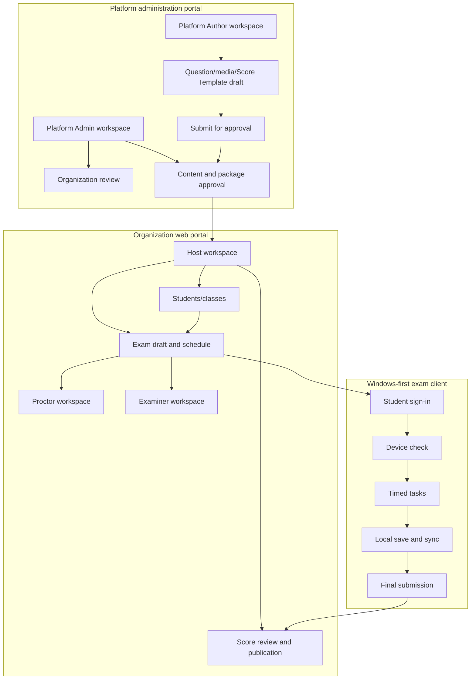
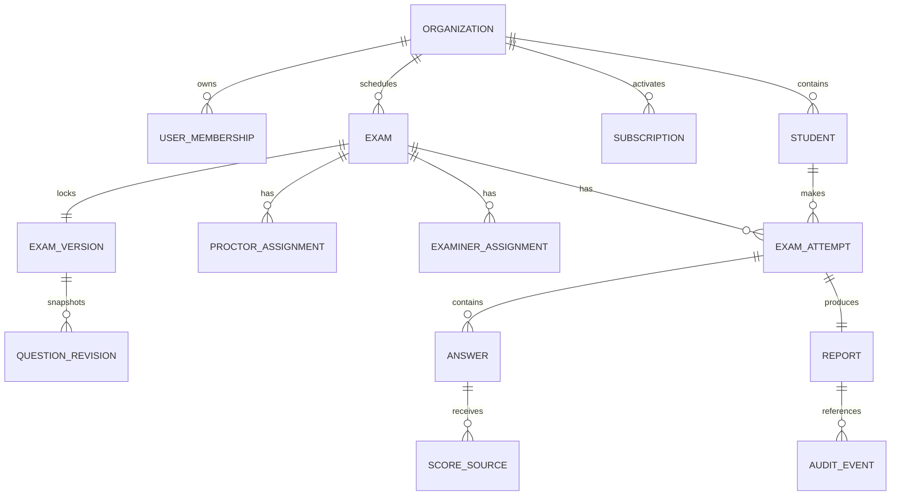

# 3. Functional Requirements

This section maps the original DOCX heading **3. Functional Requirements**. It describes observable system behavior, authorization, data effects, non-screen processing, and the 12 approved feature groups. Each requirement has a stable ID, status, evidence note, and acceptance condition.

## 3.1 Functional overview

PTE Prep coordinates five connected business stages:

1. establish an approved organization and safe access;
2. prepare governed content, media, task behavior, and Score Templates;
3. prepare the organization roster, package capacity, and exam draft;
4. deliver a fixed, timed Student attempt with recoverable answers and assigned supervision;
5. score, review, publish, audit, and display the own report.

The web portals are used for administration and operations. The Windows-first client is used for timed Student delivery. External services are isolated behind provider contracts. A user-facing screen is not sufficient by itself: important state transitions, retries, validation, and audit behavior are also requirements.

**Status/evidence rule:** Requirement IDs describe the approved baseline. Product implementation labels in this section use Current, Partial, Planned/Future, or TBD only where evidence allows. `EVD-FOUNDATION-003` and `EVD-FOUNDATION-004` support source/UI/API slices; approved plans support Planned/Future through `EVD-FOUNDATION-005` and `EVD-FOUNDATION-007`.

## 3.2 Screen and workspace flow

**Diagram ID:** `SD-REQ-SCREEN-001`  
**Caption:** PTE Prep workspace and delivery screen flow  
**Status:** Planned/Future summary of requirements; individual screens must be verified against the current route/client evidence before being labelled Current.  
**Evidence/source:** `EVD-FOUNDATION-001`, `EVD-FOUNDATION-003`, `EVD-FOUNDATION-004`.  
**Related requirements:** `FR-ONBOARD-001`, `FR-CONTENT-001`, `FR-EXAM-001`, `FR-DELIVERY-001`, `FR-REPORT-001`.

### 3.2.1 Authorization model

| Operation | Platform Admin | Platform Author | Host | Proctor | Examiner | Student | External Integration Services |
|---|---:|---:|---:|---:|---:|---:|---:|
| Review organization registration | Yes | No | No | No | No | No | No |
| Draft shared content | Yes, support/override policy | Yes | No | No | No | No | Contract input only |
| Approve/publish shared content | Yes | No | No | No | No | No | No |
| Manage organization Students/classes | Platform support only | No | Own organization | No | No | No | No |
| Activate organization package | Support/administration | No | Own organization | No | No | No | Payment/media contract only |
| Create and publish an exam | Support/administration | No | Own organization | No | No | No | No |
| Monitor an exam | Platform audit/support only | No | Policy/assignment management | Assigned exam | No | Own status visibility | No |
| Score an answer | Review/support only | No | Review/final source | No | Assigned answer | No | Provider result where configured |
| Publish a report | Platform audit/support only | No | Own organization | No | No | No | Notification only |
| View own attempt/report | Authorized support | Draft scope only | Organization view | Assigned view | Assigned view | Own only | Contract-limited |

Authorization must be checked at both the workspace/route level and the business-record level. A valid sign-in does not permit cross-organization access or unassigned Proctor/Examiner work.

**Requirement IDs:** `CR-AUTH-001`, `CR-AUTH-002`, `CR-TENANT-001`.  
**Status/evidence:** Current boundary requirement; implementation slices must be verified using `EVD-FOUNDATION-003` and `EVD-FOUNDATION-004`.  
**Acceptance:** a user attempting an operation outside the table receives a clear denial and no data mutation.

## 3.3 FEAT-01 — Account and organization onboarding

#### FR-ONBOARD-001 — Accept a public organization registration

| Field | Requirement |
|---|---|
| Actor | Organization registrant; Platform Admin reviews later. |
| Preconditions | Public registration entry point is available. |
| Behavior | Capture required organization/contact details, validate field completeness and duplicate indicators, and store a `PENDING` registration without creating an active workspace. |
| Alternate/error | Invalid or duplicate data returns field-level feedback; repeated submission does not silently create a second organization. |
| Data effect | Creates a registration request and audit/event context, not an active package or Student account. |
| Authorization | Public submission may create only a pending request; it cannot use tenant operations. |
| Status/evidence | Partial/Current only for verified route and persistence slice; otherwise Planned/Future. `EVD-FOUNDATION-003`, `EVD-FOUNDATION-004`. |
| Acceptance | A pending request is visible to an authorized Platform Admin and cannot open Host workspace functions. |

#### FR-ONBOARD-002 — Review, approve, or reject registration

| Field | Requirement |
|---|---|
| Actor | Platform Admin. |
| Preconditions | Registration is pending and visible in the platform workspace. |
| Behavior | View submitted details, approve or reject, and record decision time and reason where rejected. |
| Alternate/error | Already decided requests are idempotent or show their current decision; unauthorized users are denied. |
| Data effect | Approval enables organization/first Host creation; rejection keeps the request non-operational. |
| Status/evidence | Partial/Planned/Future according to evidence. `EVD-FOUNDATION-001`, `EVD-FOUNDATION-003`. |
| Acceptance | Only an approved request can transition to active organization setup. |

#### FR-ONBOARD-003 — Create the approved organization and first Host

| Field | Requirement |
|---|---|
| Actor | System after Platform Admin approval; Platform Admin may support recovery. |
| Preconditions | Registration decision is approved and has not already been materialized. |
| Behavior | Create one organization, its initial Host relationship, and the controlled access state without duplicating records on retry. |
| Alternate/error | Partial creation is recoverable and visible; retry does not create a second organization or Host. |
| Data effect | Establishes tenant ownership and Host scope. |
| Status/evidence | Planned/Future unless source/API evidence proves the end-to-end path. `EVD-FOUNDATION-005`. |
| Acceptance | The resulting Host can sign in only to the new organization after activation rules are satisfied. |

#### FR-ONBOARD-004 — Support account/session recovery

| Field | Requirement |
|---|---|
| Actor | Any approved human role; Platform Admin controls administrator-assisted recovery. |
| Preconditions | Account exists and recovery policy permits the action. |
| Behavior | Support sign-in, sign-out, password change/reset, session renewal, lock, and suspension states with clear messages. |
| Alternate/error | Expired/locked/suspended accounts cannot perform business operations; recovery cannot change tenant ownership. |
| Data effect | Updates credential/session status and audit record. |
| Status/evidence | Partial/Planned/Future; security target links `NFR-SEC-001`–`NFR-SEC-003`. |
| Acceptance | A recovered account sees the same authorized scope and no broader data. |

## 3.4 FEAT-02 — Organization, Student, program, class, and enrollment management

#### FR-ORG-001 — Maintain organization-owned Students

Host can create, edit permitted profile fields, deactivate, search, filter, sort, and paginate Students belonging to the Host’s organization. The system validates required values, duplicate identity indicators, and organization capacity before committing a record.

**Status:** Current/Partial only where the tenant roster UI/API is verified (`EVD-FOUNDATION-003`, `EVD-FOUNDATION-004`); the complete lifecycle is a requirement baseline.  
**Acceptance:** A Host cannot read or mutate a Student outside the organization.

#### FR-ORG-002 — Import a Student roster with row-level validation

The Host may submit a supported bulk file or equivalent input. The system validates the whole input, reports missing/invalid/duplicate rows, and makes the commit outcome explicit. It must not silently create a partial roster while claiming success.

**Related:** `NFR-PERF-004`, `BR-ACCESS-010`.  
**Acceptance:** Every rejected row has a reason and every committed Student has an audit context.

#### FR-ORG-003 — Manage programs and classes

The Host can create, update, activate/deactivate, search, and view programs/classes. A Student membership change is explicit, tenant-scoped, and auditable. A later membership change does not rewrite an already published exam audience.

**Acceptance:** The class/program view shows current membership and does not leak another organization’s roster.

#### FR-ORG-004 — Manage Student membership and transfer

The Host can add/remove/transfer a Student according to the organization policy. The system checks duplicate membership and records the prior/new class/program context.

**Acceptance:** A duplicate membership is either prevented or explained; no silent duplicate row is created.

#### FR-ENROLL-001 — Select candidates by Student, class, or program

When preparing an exam, the Host may select individual Students, an active class, or an active program. The system expands the selection into a candidate set and displays its source.

**Acceptance:** A reviewer can tell why each Student is included and can remove a candidate before validation.

#### FR-ENROLL-002 — Deduplicate and explain candidate exclusions

The system removes repeated candidate references and identifies Students excluded for duplicate, inactive, missing, already assigned, schedule conflict, or capacity reason. It must not silently change the list.

**Acceptance:** Candidate preview distinguishes selected, included, excluded, and blocked counts with explanations.

## 3.5 FEAT-03 — Shared question bank and image/audio media

#### FR-CONTENT-001 — Create and edit a task-specific question draft

Platform Author creates a draft using one of the 23 task catalog rows. The draft includes prompt/content fields, expected response form, score behavior, and required media references. The task type is not free text when a catalog type exists.

**Acceptance:** An invalid task structure cannot be submitted for approval.

#### FR-CONTENT-002 — Manage media through an approved signed boundary

Platform Author uploads or selects image/audio through the approved media contract. The system stores the relationship and completion state without exposing provider credentials in the browser or Markdown documentation.

**Status:** Partial/Planned/Future by integration evidence; `EVD-FOUNDATION-003`, `EVD-FOUNDATION-005`.  
**Acceptance:** Expired or failed media access is shown as a recoverable content issue.

#### FR-CONTENT-003 — Validate required content before approval/publication

The system checks required prompt, answer/rubric, media, task metadata, and supported response type. A question with incomplete required media cannot be approved/published as usable exam content.

**Acceptance:** The reviewer sees each blocking item and the content remains in the prior non-published state.

#### FR-CONTENT-004 — Preserve question revisions

Editing a published question creates a new revision. A revision referenced by a generated or running exam is immutable for that attempt. Archive/recovery operations retain the historical reference.

**Acceptance:** A later edit does not change the prompt/media/rubric presented to an existing attempt.

#### FR-CONTENT-005 — Govern approval and publication

Platform Author may submit; Platform Admin may approve, reject, publish, archive, or recover according to state. Host can select published content through a Score Template but cannot directly publish shared content.

**Acceptance:** The approval history shows actor, decision, time, reason, and revision.

## 3.6 FEAT-04 — Score Templates and task rules

#### FR-TEMPLATE-001 — Create a Score Template draft

Platform Author creates a template with sections, selected task catalog rows, task counts, timing rules, skill weights, score-source eligibility, and the treatment of unscored Personal Introduction. The template records a revision rather than overwriting an active version.

#### FR-TEMPLATE-002 — Validate, approve, activate, and retire a template

Platform Admin validates and controls the lifecycle. An invalid or incomplete template remains non-active. A retired template cannot be selected for a new exam but remains available to historical snapshots.

#### FR-TEMPLATE-003 — Select only active templates for an exam

Host can select an active template and view its scope, timing, task types, weights, and source policy. Host cannot edit common scoring rules inside the exam.

#### FR-TEMPLATE-004 — Snapshot the template for an exam

At the exam lock/generation point, the system stores the selected template revision and task rules used for the exam. Later template edits do not rewrite a locked exam.

**Related:** `DB-SCORE-TEMPLATE`, `BR-CONTENT-014`–`BR-CONTENT-016`, `NFR-DATA-004`.

## 3.7 FEAT-05 — Packages, payment integration, licenses, and limits

#### FR-PACKAGE-001 — Maintain package definitions

Platform Admin creates/updates/activates/archives packages with allowed exam mode, time window, Student capacity, and organization-level limits. The product exposes package status and effective dates to authorized Hosts.

#### FR-PACKAGE-002 — Create and track an organization order

Host can create an order for an organization package and view its pending/success/failure/expired state. Registration itself is not a payment action.

#### FR-PACKAGE-003 — Verify payment callback before activation

External payment callback is validated by the configured contract and correlation data. Browser return alone is not proof. Duplicate callbacks are safe and cannot create a second activation.

#### FR-PACKAGE-004 — Redeem and revoke a license code

Platform Admin issues or controls license codes; Host redeems an eligible code once. The system records code, organization, package, dates, limits, and revocation state. A revoked/expired license cannot authorize a new exam.

#### FR-PACKAGE-005 — Enforce package and exam capacity

Before exam publication and candidate commit, the system checks active package, time window, organization limits, per-exam limit, and selected Student count. The result identifies the blocking limit.

#### FR-PACKAGE-006 — Keep Student outside package ownership

Students use an organization assignment. They do not buy a personal package, own a license, or activate a subscription in this release.

## 3.8 FEAT-06 — Exam setup, validation, generation, and scheduling

#### FR-EXAM-001 — Create and edit an exam draft

Host creates a draft with name/description, mode, policy, date/time, package, Score Template, candidate source, and staff assignments. Draft edits remain available until a lifecycle lock.

#### FR-EXAM-002 — Select exam mode and policy

Host selects the supported practice/mock/official-like policy offered by the product baseline. The policy controls form mode, integrity controls, timing, retry, and publication behavior. “Official” in this context means an internal strict practice configuration, not PTE Academic certification.

#### FR-EXAM-003 — Validate content, package, date, roster, and conflict conditions

Pre-exam validation checks content completeness, active template, package validity, package time window, Student count, duplicate candidates, schedule conflicts, required Proctor/Examiner assignments, and mode-specific policy. It returns a structured result with blocking/warning items.

#### FR-EXAM-004 — Generate an exam version and forms

The system generates the content/policy snapshot and form mode selected for the exam. It records generation status and provenance. Generation must be safe to retry and must not publish partial forms.

#### FR-EXAM-005 — Support shared or unique forms by policy

Practice may use `SHARED_FORM`; Mock Test and Official-like modes default to `UNIQUE_FORM_PER_STUDENT` unless an approved policy says otherwise. The chosen mode is visible before publication and stored with the exam.

#### FR-EXAM-006 — Publish and lock the exam

Host can publish only after blocking validation items are resolved. Publication freezes the candidate audience, selected content revisions, Score Template revision, form/version policy, and exam policy for delivery.

#### FR-EXAM-007 — Open, close, cancel, or recover lifecycle states

Host can perform permitted transitions. A failed generation remains pending/error and can be retried or cancelled according to the recovery policy. Closing or cancellation preserves the audit trail and does not fabricate Student submission.

#### FR-EXAM-008 — Prevent unsafe package overlap

Two exams using one license cannot have overlapping active windows when the package rule forbids it. Different licenses may overlap if policy allows. The system explains the conflicting license/exam.

#### FR-EXAM-009 — Retain provenance for generated content

The exam records selected question/media revisions, Score Template revision, randomization/selection policy if used, seed/provenance where applicable, candidate snapshot, and generation actor/time. Missing provenance is a release blocker for a fixed exam.

## 3.9 FEAT-07 — Student exam delivery and answer submission

#### FR-DELIVERY-001 — Admit only eligible assigned Students

Student can enter only when the exam is published/open, the Student is in the frozen audience, the account/organization is active, and the attempt policy permits entry.

#### FR-DELIVERY-002 — Complete the device check before timed work

The Windows-first client checks supported device/audio/microphone and required connectivity/policy items before timed tasks. A failure shows the item and permitted correction/escalation path.

#### FR-DELIVERY-003 — Render the fixed task catalog and content

The client renders the task type, prompt, text, image/audio, response control, preparation/response timing, and instructions from the fixed exam snapshot. It supports the 22 scored task types and the unscored Personal Introduction row when included by policy.

#### FR-DELIVERY-004 — Apply task and attempt timing

The client applies preparation/response and exam timing supplied by the Score Template/exam snapshot. Timer state is visible and cannot be changed by an ordinary Student action.

#### FR-DELIVERY-005 — Save each answer locally before synchronization

Text, selection, recorded audio, and other supported responses are written to the client’s local pending state before network transmission is treated as complete. The local state identifies task/attempt and save status.

#### FR-DELIVERY-006 — Synchronize answers and retry after interruption

The client sends pending answers with a safe correlation key. Connectivity interruption leaves a visible queued/retryable state. Retry must not duplicate the accepted answer or silently drop a local response.

#### FR-DELIVERY-007 — Validate an answer at acceptance

The service verifies Student ownership, exam/form/task identity, attempt status, task revision, response shape, and policy before accepting an answer. Invalid answers return a reason and do not overwrite a valid accepted answer.

#### FR-DELIVERY-008 — Submit an attempt once

Student can submit when required tasks and policy conditions allow. Submission is idempotent or returns the existing final state; a second attempt is blocked unless an approved retake policy exists.

#### FR-DELIVERY-009 — Support approved intervention and recovery

Proctor or system policy may force-submit, extend time, or otherwise intervene only when the fixed policy permits. Every intervention is visible to authorized users and auditable.

## 3.10 FEAT-08 — Proctoring and exam integrity

#### FR-INTEGRITY-001 — Assign Proctors to exams

Host assigns one or more Proctors to the exam. The assignment is scoped, visible to the Proctor, and checked before monitoring actions.

#### FR-INTEGRITY-002 — Monitor assigned Student/attempt state

Proctor sees assigned Student/attempt state, connection/answer synchronization indicators, device-check result, and permitted warnings. The view uses text/status in addition to color.

#### FR-INTEGRITY-003 — Record violation or assistance event

Proctor records event type, affected attempt, time, detail, severity/policy, and action. The event is immutable or revision-traced after recording according to audit policy.

#### FR-INTEGRITY-004 — Apply policy-specific integrity response

Practice unrestricted, controlled practice, and strict exam policies may differ. The attempt stores the effective policy. Initial Practice violation behavior warns and audits; it does not automatically invalidate or terminate without an approved rule.

#### FR-INTEGRITY-005 — Isolate advanced anti-cheat boundaries

Virtual-machine detection, screen recording, complete secondary-device blocking, and comparable advanced controls are out of scope for this requirement baseline. If introduced later, they require new requirements, privacy review, and test evidence.

## 3.11 FEAT-09 — Examiner assignment, marking, and score-source review

#### FR-SCORE-001 — Create a scoring assignment pool

Host selects exam/Student/attempt scope and assigns answers or attempts to an Examiner. The system prevents the same unit from being concurrently owned by conflicting assignments unless the policy explicitly allows review.

#### FR-SCORE-002 — Provide an Examiner work queue

Examiner sees only assigned work with prompt/content revision, Student response, rubric/Score Template context, status, and submission action.

#### FR-SCORE-003 — Save and submit Examiner scores

Examiner can save a draft where allowed and submit a score with rubric/criterion values, note, actor, time, and source revision. A submitted score is separate from an AI/objective score.

#### FR-SCORE-004 — Receive objective/AI score states

Objective scoring may complete automatically. AI scoring may be pending, successful, failed, or eligible for review. Placeholder/test results are not treated as a valid final AI score unless policy explicitly allows them.

#### FR-SCORE-005 — Review score sources

Host can view available score sources and their statuses, compare permitted values, and select the source at the allowed task/section/report scope. A narrower selection overrides a broader one only when the policy says so.

#### FR-SCORE-006 — Block publication until required scores are ready

The readiness check identifies missing, invalid, pending, failed, or unreviewed required scores. Publication is blocked until the applicable conditions are met.

#### FR-SCORE-007 — Preserve score provenance

Every selected score links to task, attempt, question revision, Score Template revision, source type, source status, reviewer, and time.

## 3.12 FEAT-10 — Reports, publication, notification, and audit

#### FR-REPORT-001 — Aggregate task and skill scores

The system calculates task/section/skill and permitted Overall values using the locked Score Template and source-selection policy. A task not included in the exam does not create a false score.

#### FR-REPORT-002 — Represent report readiness and pending states

The report shows whether required scoring is complete, pending, failed, or ready. It never presents an incomplete report as final merely because a page can be opened.

#### FR-REPORT-003 — Publish a report under Host control

Host can publish a ready report for the permitted exam scope. The system records actor/time and the exact version/source context.

#### FR-REPORT-004 — Restrict Student report visibility

Student sees only the Student’s own report and only after publication. Host/authorized staff see organization-scoped information; Proctor/Examiner see only their permitted operational scope.

#### FR-REPORT-005 — Record audit and supported notifications

Permission, payment, enrollment, exam policy, proctor violation, scoring approval, score-source selection, and report publication changes are auditable. Supported notifications may report state changes; a notification failure does not roll back the business action.

## 3.13 FEAT-11 — External service contracts and failure handling

#### FR-INTEGRATION-001 — Isolate payment callback processing

Payment callbacks are authorized/verified, correlated to one order, and processed idempotently. Browser navigation is informational only.

#### FR-INTEGRATION-002 — Isolate media upload and access

Media operations use signed/limited access and retain completion/status information. An expired link can be reissued without changing question identity or losing a Student answer.

#### FR-INTEGRATION-003 — Isolate AI scoring provider behavior

AI requests carry a safe correlation key and expose pending/success/failure/retry/review state. Provider choice and quality thresholds remain TBD where not approved.

#### FR-INTEGRATION-004 — Isolate email/notification delivery

Notification delivery records attempted/sent/failed status and retry policy. Failure does not roll back payment, enrollment, exam, score, or publication.

#### FR-INTEGRATION-005 — Surface integration status to users

Host/Platform Admin/Student sees a business-readable state and next action where an integration affects their workflow. Private provider credentials and raw sensitive payloads are not exposed.

#### FR-INTEGRATION-006 — Handle duplicate, timeout, and provider recovery

The system identifies duplicate callbacks/results, supports safe retry, and reconciles delayed provider responses without duplicate business effects.

## 3.14 FEAT-12 — Exam provenance and platform hardening

#### FR-HARDENING-001 — Store generation provenance

The system records fixed-version inputs, source revisions, selection/randomization context, mode, audience, and generation result so a Host can explain what a Student received.

#### FR-HARDENING-002 — Enforce tenant/assignment isolation

Every organization-owned and assignment-owned read/write path checks tenant/assignment scope. A public identifier alone is not sufficient authorization.

#### FR-HARDENING-003 — Preserve idempotent state transitions

Registration approval, package activation, candidate enrollment, generation, answer synchronization, submission, scoring result, and publication must be safe to retry or must return the existing state.

#### FR-HARDENING-004 — Keep unsupported hardening explicit

Advanced anti-cheat, adaptive/IRT behavior, official certification, and permanent no-repeat content guarantees remain out of scope or future. They must not appear as hidden “security” behavior in the current product description.

## 3.15 Non-screen functions and integrations

| Function | Trigger | Inputs | Output/state | Failure handling | IDs |
|---|---|---|---|---|---|
| Pre-exam validation | Host requests validation | Draft, template, package, audience, schedule, policy | Blocking/warning result | Keep draft; explain correction | `FR-EXAM-003`, `BR-EXAM-023` |
| Form/version generation | Host passes validation | Selected revisions, audience, mode, seed/provenance policy | Generated snapshot and status | Retry/cancel; never publish partial form | `FR-EXAM-004`, `FR-HARDENING-001` |
| Local answer outbox | Student saves answer | Attempt/task/response/local correlation | Local pending record | Keep queued state on network failure | `FR-DELIVERY-005`–`FR-DELIVERY-006` |
| Answer acceptance | Client syncs answer | Student/attempt/task/payload/version | Accepted/rejected result | Return reason; idempotent retry | `FR-DELIVERY-007` |
| Objective/AI scoring | Submission/Host request | Answer, source policy, provider contract | Score source state | Pending/retry/failure/review | `FR-SCORE-004`, `FR-INTEGRATION-003` |
| Examiner queue | Host assigns | Attempt/task pool, Examiner | Assignment and queue state | Prevent conflicting assignment | `FR-SCORE-001`–`FR-SCORE-003` |
| Report readiness | Host requests review | Score sources and locked template | Ready/blocking result | Keep unpublished with reasons | `FR-SCORE-006`, `FR-REPORT-002` |
| Audit append | Sensitive action occurs | Actor, scope, action, target, outcome | Audit record | Business action must not appear successful without required audit handling | `FR-REPORT-005`, `NFR-AUDIT-001` |

## 3.16 ERD and relationship requirement

The final design report contains the detailed ERD. The requirement-level relationship view is:

**Diagram ID:** `DB-REQ-RELATION-001`  
**Caption:** Requirement-level ownership and scoring relationships  
**Status:** Planned/Future design placeholder; exact table names/columns are defined in Report 4 only where evidence supports them.  
**Evidence/source:** `EVD-FOUNDATION-003`, `EVD-FOUNDATION-005`;  
**Related requirements:** `FR-HARDENING-001`–`FR-HARDENING-003`, `FR-EXAM-009`, `FR-SCORE-007`, `FR-REPORT-005`.

## 3.17 Functional acceptance principles

- Every state-changing action identifies the actor, scope, target, and resulting state.
- Every retryable operation is idempotent or returns the previously accepted state.
- Every fixed exam attempt can be traced to the content, media, Score Template, policy, and audience snapshot used.
- Every blocked action explains the business condition and next allowed action.
- Every role sees only the data necessary for its approved scope.
- Every future, partial, or TBD integration is labelled honestly in the design, test, and guide reports.

