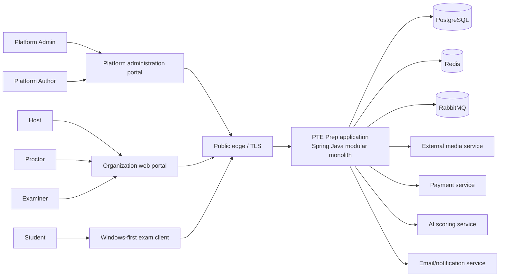
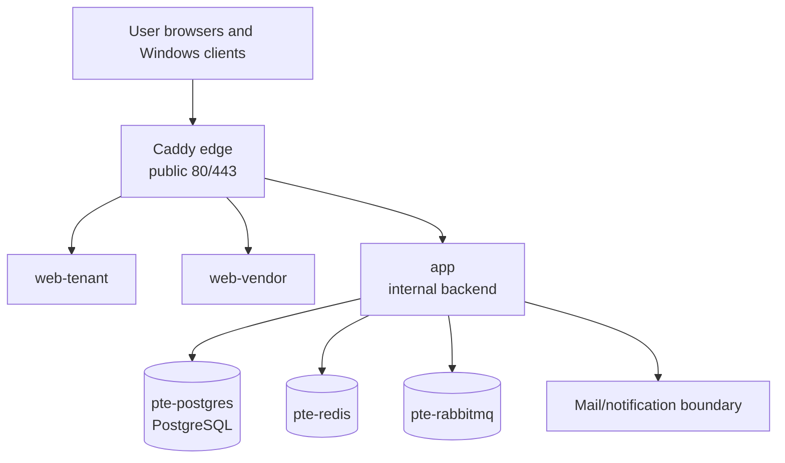

# 1. System Design

This section maps the original DOCX heading **1. System Design**. It realizes the Report 3 requirements as a business-readable technical design. The design distinguishes the current repository/deployment baseline from planned or TBD behavior.

## 1.1 Design goals and boundaries

The design must keep the four high-risk flows understandable and traceable:

1. organization registration → approval → Host access → package readiness;
2. content/media/Score Template → exam draft → validation → fixed version → schedule;
3. device check → timed Student tasks → local answer save → synchronization/retry → submission and Proctor audit;
4. objective/AI/Examiner score → Host source review → report readiness → publication → Student visibility.

The production backend is designed as one Spring/Java modular-monolith application behind the public edge. The package boundaries inside the application describe ownership and dependency direction; they are not separate public deployment units. PostgreSQL is the shared relational database for this application baseline. Redis and RabbitMQ are supporting infrastructure, not user-facing product portals.

**Status/evidence:** The application and Compose boundaries are supported by `EVD-FOUNDATION-003` and `EVD-FOUNDATION-006` (verified 2026-10-06). Detailed future event/provider behavior is `Planned/Future` or `TBD` under `EVD-FOUNDATION-005`, `EVD-FOUNDATION-007`, and the TBD register.

## 1.2 Context and channel design

**Diagram ID:** `SD-ARCH-CONTEXT-001`  
**Caption:** PTE Prep channels, application boundary, and external services  
**Status:** Current architecture boundary with Partial/Planned external feature slices.  
**Evidence/source:** `EVD-FOUNDATION-003`, `EVD-FOUNDATION-004`, `EVD-FOUNDATION-006`.  
**Related Report 3 IDs:** `FR-ONBOARD-001`, `FR-INTEGRATION-001`–`FR-INTEGRATION-006`, `NFR-19`.

### 1.2.1 Public and internal boundaries

- **Public edge:** terminates TLS and routes web/API traffic by supported domain/path. Users access the supported public edge, not internal application ports.
- **Web clients:** tenant/organization and platform/vendor web applications provide role-specific workspaces and call the application contract.
- **Windows client:** receives the fixed exam snapshot through the supported delivery contract and sends answer/heartbeat/submission state with safe correlation.
- **Application:** authenticates, authorizes, validates, coordinates domain operations, persists state, and exposes business-readable results.
- **Database/support:** PostgreSQL is the source of relational business state; Redis supports configured cache/rate-limit/single-flight behavior; RabbitMQ supports configured asynchronous work.
- **External services:** media, payment, AI scoring, email/notification are isolated at integration boundaries. No provider credential appears in a client or report.

## 1.3 Deployment topology

**Diagram ID:** `SD-ARCH-DEPLOY-001`  
**Caption:** Single-stack Docker Compose deployment boundary  
**Status:** Current deployment topology; availability/capacity targets remain unverified.  
**Evidence/source:** `pte-api/docker-compose.yml`, `pte-api/docker-compose.services.yml`, `pte-api/docker-compose.deploy.yml`, `EVD-FOUNDATION-006`.  
**Related Report 3 IDs:** `FR-INTEGRATION-004`, `FR-HARDENING-002`, `NFR-05`–`NFR-08`, `NFR-19`.

The hosted stack uses one Oracle VPS and one Docker network for the application, web clients, edge, PostgreSQL, Redis, and RabbitMQ. The deployment overlay applies restart and memory policy. A healthcheck or local Compose status is operational evidence for that environment only; it is not automatically evidence of the SRS availability target.

## 1.4 Application package ownership

Each package owns one business concern and exposes a small public service/API surface to other packages. Internal repository, mapper, controller, and vendor details stay inside the owning package.

| ID | Package/module owner | Main responsibility | Owns | May depend on |
|---|---|---|---|---|
| `PKG-IDENTITY` | Identity/access | Sign-in, session, account status, role assignment, recovery | Credential/session and role policy | Shared security/config |
| `PKG-TENANCY` | Organization/tenant | Organization lifecycle, ownership, Host scope, Student quota | Organization and tenant boundaries | Identity, audit |
| `PKG-ITEMBANK` | Shared content | Task catalog, questions, revisions, media requirements | Question/revision lifecycle | Media integration, audit |
| `PKG-SCORETEMPLATE` | Score Template | Task composition, timing, weights, source eligibility, lifecycle | Template revisions | Item bank, audit |
| `PKG-BILLING` | Package/license | Packages, orders, callbacks, subscriptions, limits | License and usage rules | Tenant, payment integration, audit |
| `PKG-SESSION` | Exam setup | Draft, candidate selection, validation, generation, scheduling, lifecycle | Exam and schedule state | Tenant, item bank, Score Template, billing, audit |
| `PKG-ASSESSMENT` | Fixed assessment version | Blueprint/snapshot generation and provenance | Immutable form/version content | Session, item bank, Score Template |
| `PKG-ATTEMPT` | Student delivery | Attempt, timer, answer, local-sync contract, submit, heartbeat | Attempt/answer states | Assessment, identity, tenant, audit |
| `PKG-PROCTORING` | Supervision/integrity | Proctor assignment, monitoring state, violation/audit events | Proctor session/violation state | Session, attempt, audit, notification |
| `PKG-SCORING` | Scoring | Objective/AI/Examiner source state, queue, score results | Score-source records | Attempt, Score Template, provider boundaries |
| `PKG-REPORTING` | Reports/publication | Aggregation, readiness, score-source selection, publication | Report/publication state | Attempt, scoring, session, audit |
| `PKG-NOTIFICATION` | Notification | Supported event-to-message delivery and retry state | Notification attempt state | Reporting, proctoring, identity, email boundary |
| `PKG-SUPPORT` | Support/audit access | Support tickets and controlled assistance | Support request and audit reference | Identity, tenant, audit |
| `PKG-SHARED` | Cross-cutting shared utilities | Error/message/correlation/time abstractions | Shared contracts only | No business ownership |

**Package diagram ID:** `PKG-DIAGRAM-001`  
**Caption:** Ownership map for the modular-monolith application  
**Status:** Current package map from source inventory with feature-specific slices classified separately.  
**Evidence/source:** `pte-api/app/src/main/java/com/pte`, `EVD-FOUNDATION-003`.  
**Related Report 3 IDs:** `FR-HARDENING-002`, `FR-HARDENING-003`, `CR-AUTH-001`, `NFR-19`.

### Dependency direction

1. Web/client controllers call the owning public application service, not another package’s repository.
2. A package may request another package’s public decision/check or consume an explicit event/contract; it must not reach into the other package’s internal objects.
3. Domain rules and state transitions live in the owning package. Client validation is helpful feedback, never the final authorization or integrity check.
4. Provider SDKs and provider payloads stay behind `External Integration Services` adapters; domain packages use a project contract/result rather than a vendor type.
5. Audit is appended from the operation owner with actor/scope/target/outcome; it is not reconstructed from UI logs.

## 1.5 Authentication, authorization, and tenant scope

### Authentication boundary

The identity package establishes a signed-in principal and account status. It handles sign-in, sign-out, session renewal, password change/reset, lock, and suspension. A successful authentication does not grant access to every tenant or assignment.

### Authorization boundary

Every protected operation evaluates:

- authenticated principal and active account;
- human role;
- organization/tenant scope;
- Proctor or Examiner assignment scope when applicable;
- ownership of the target record;
- current lifecycle state and allowed transition;
- action-specific policy (for example, publication or score-source selection).

Public identifiers are lookup keys, not authorization. Repository/query methods that access organization or assignment data require the relevant scope in the owning service contract.

### Visibility matrix

| Data | Platform Admin | Platform Author | Host | Proctor | Examiner | Student |
|---|---|---|---|---|---|---|
| Organization registration | Platform-wide | No | Own post-approval context | No | No | No |
| Shared content drafts/revisions | Platform-wide policy scope | Assigned draft scope | Select published only | No | No | Delivered snapshot only |
| Student roster | Controlled support | No | Own organization | Assigned exam subset | Assigned work context | Own identity/attempt |
| Answers/audio | Authorized operational/audit purpose | No | Own organization policy | Assigned attempt policy | Assigned answers | Own answers |
| Scores/reports | Platform audit/support | No | Own organization | Assigned status only | Assigned score context | Own published report |

## 1.6 External integration design

### Media

The browser/client requests a short-lived signed upload/access instruction from the application, uploads directly to **Cloudinary** (the configured initial media service) where enabled, and reports the resulting media reference. The application validates media completion and associates it with a question revision. A failed or expired link returns a retryable status. Credentials never travel through the report or client.

### Payment

The application creates a provider-correlated order. The provider callback is verified and processed idempotently. Browser return is not payment proof. The billing package owns subscription/license activation; the payment adapter owns provider-specific request/response translation.

### AI scoring

The scoring package creates a correlated provider request when the task and policy allow it. A worker or asynchronous handler records pending, success, failure, retry, or review-needed status. Provider quality thresholds, final provider, and task-level Examiner review remain `TBD-AI-001`/`TBD-AI-002`. A failed provider response does not become a valid final score.

### Notification

Notification consumes an approved business event/state and records delivery attempt. It does not own the report, subscription, exam, or score state. Retries are bounded and do not roll back the originating business operation.

**Integration decision ID:** `ADR-INTEGRATION-001`  
**Decision:** isolate provider contracts behind adapters and keep the business result in the owning package.  
**Status:** Current boundary; provider-specific coverage is Partial/Planned/TBD.  
**Evidence/source:** `EVD-FOUNDATION-003`, `EVD-FOUNDATION-005`, `EVD-FOUNDATION-007`.  
**Related requirements:** `FR-INTEGRATION-001`–`FR-INTEGRATION-006`, `BR-INTEGRATION-044`–`BR-INTEGRATION-048`, `NFR-19`.

## 1.7 Cross-cutting state principles

### Fixed exam version

The session package validates and asks the assessment package to create a fixed version. The version contains the selected task/prompt/media revisions, Score Template revision, form mode, candidate snapshot, integrity policy, and provenance. The attempt package reads the fixed version; it does not rebuild a question from the current shared bank during a running attempt.

### Idempotency

Operations with possible retry use a business correlation key or deterministic existing-state lookup:

| Operation | Duplicate-safe outcome |
|---|---|
| Registration approval | Existing organization/Host state is returned; no duplicate tenant. |
| Payment callback/license redemption | Existing order/subscription state is returned; no second activation. |
| Candidate enrollment | Existing enrollment is returned or conflict is reported. |
| Version generation | Existing successful/pending/error generation is returned or safely resumed. |
| Answer synchronization | Accepted answer is returned; a duplicate request does not add a second accepted answer. |
| Attempt submission | Existing final state is returned. |
| Score provider result | Correlated result is upserted once and retains source status. |
| Report publication | Existing publication state is returned; notification retry is separate. |

### Audit

The owning package produces an audit record for a sensitive state change. The record includes actor, actor role, organization/assignment scope, action, target type/ID, previous/result status where safe, time, correlation reference, and outcome. Raw answer/media content and credentials are not copied into ordinary audit text.

## 1.8 Design decisions and unresolved items

| ID | Decision/status | Consequence |
|---|---|---|
| `ADR-ARCH-001` | One deployed Spring/Java modular-monolith application behind an edge; Current topology. | Package ownership and public boundaries must remain explicit. |
| `ADR-ARCH-002` | One PostgreSQL database for the application baseline; Current topology. | Cross-package access uses public service/API boundaries, not unrelated repositories. |
| `ADR-EXAM-001` | Fixed assessment snapshot before delivery; requirement/design baseline. | Shared content edits do not rewrite attempts. |
| `ADR-ANSWER-001` | Local-first answer persistence with retryable synchronization; Partial/Planned pending end-to-end evidence. | Client and server tests must cover interruption, duplicate, and recovery. |
| `ADR-PROCTOR-001` | Proctor events are assignment-scoped and auditable; exact synchronization remains `TBD-PROCTOR-001`. | Do not claim guaranteed live delivery timing. |
| `ADR-SCORE-001` | Host chooses final score source after objective/AI/Examiner sources are visible; AI/provider policy TBD. | Publication readiness must block incomplete sources. |
| `ADR-DATA-001` | Contract-based retention; exact period and jurisdiction are TBD. | Guides and operations cannot promise a universal deletion date. |
