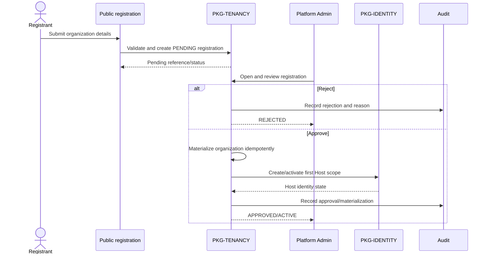
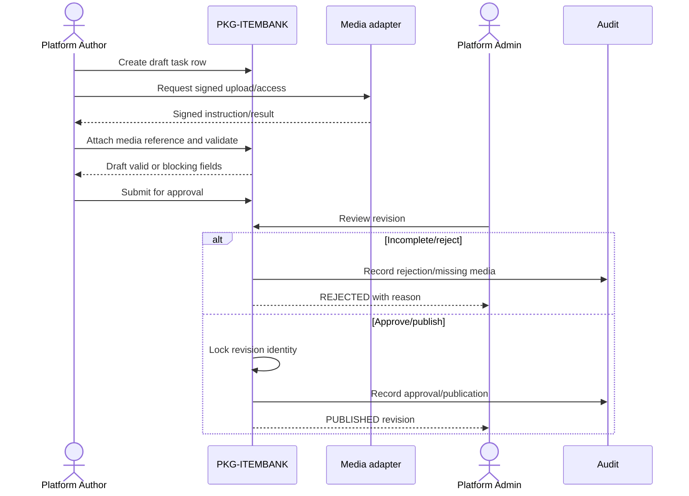
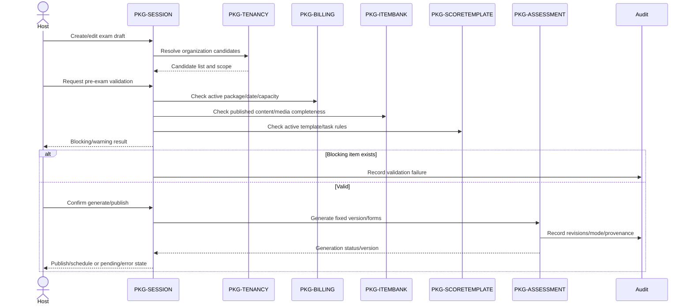
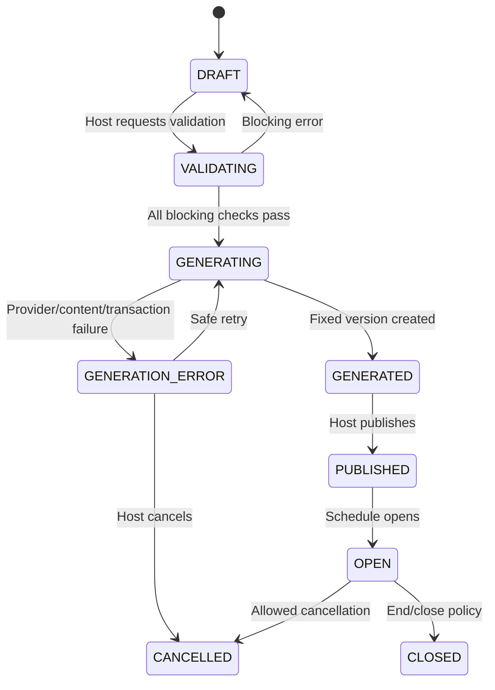
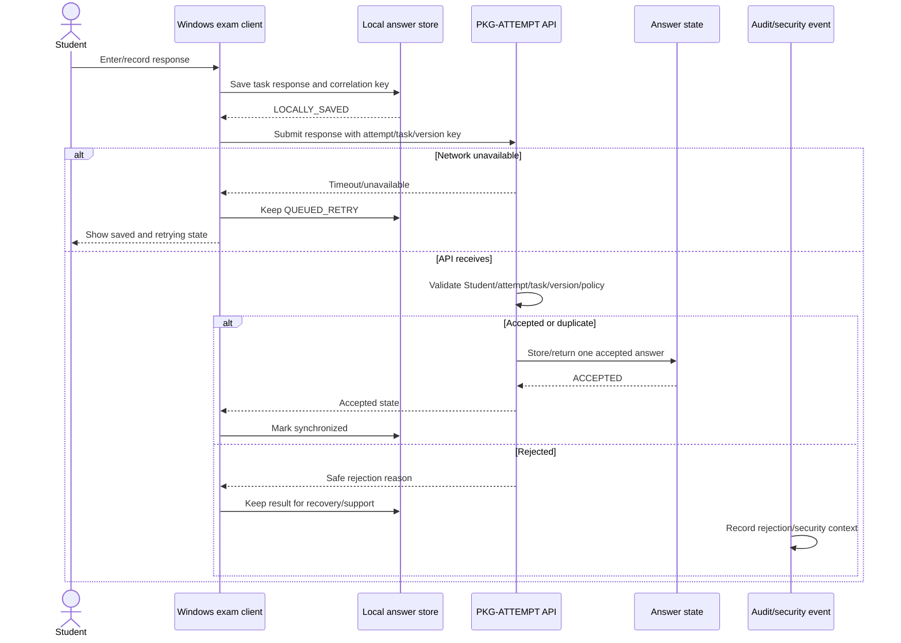
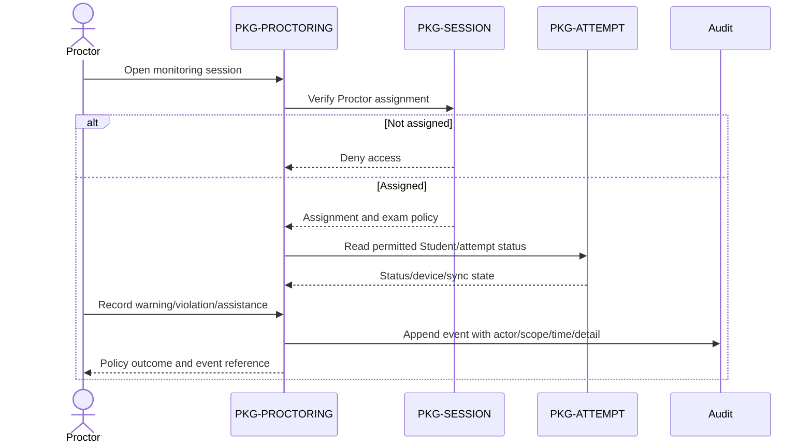
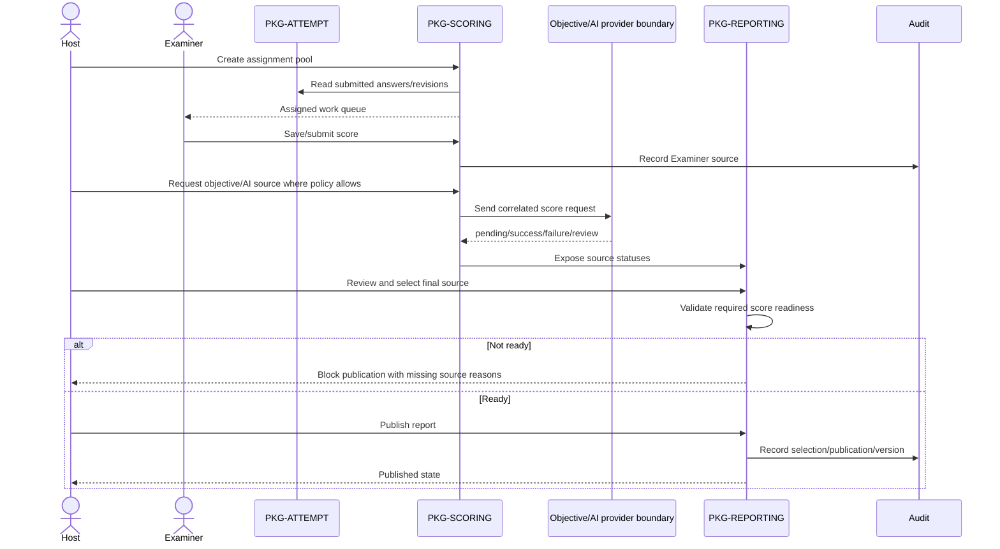

# 3. Detailed Design

This section maps the original DOCX heading **3. Detailed Design**. It explains how the most important PTE Prep flows cooperate across owned packages. The descriptions are implementation-oriented but remain tied to the Report 3 business requirements. A future or TBD step is labelled rather than presented as a working product behavior.

## 3.1 Detailed design notation

| Notation | Meaning |
|---|---|
| `PKG-*` | Owning application package from System Design. |
| `DB-*` | Logical data entity/invariant from Database Design. |
| `SEQ-*` | Interaction sequence in this section. |
| `SD-*` | Design element/decision. |
| `FR-*` / `BR-*` | Requirement/business-rule link from Report 3. |
| `Current` | Source/configuration/UI/API evidence supports the claim. |
| `Partial` | An implementation slice exists but the complete journey or safeguard is incomplete. |
| `Planned/Future` | Approved design direction without current end-to-end evidence. |
| `TBD` | A policy, contract, or recovery decision is not fixed. |

## 3.2 Onboarding and Host activation

### Components and responsibilities

| Component | Responsibility |
|---|---|
| Public registration controller | Accepts and validates registration input; creates only `DB-REGISTRATION` in pending state. |
| `PKG-TENANCY` registration service | Owns approval transition, organization materialization, tenant scope, and first Host relationship. |
| `PKG-IDENTITY` | Creates/activates the Host principal and applies sign-in/session policy. |
| `PKG-BILLING` | Keeps package/order/subscription separate from registration; checks package state later. |
| Audit writer | Records registration decision, materialization, account state, and support actions. |
| Notification boundary | May inform the registrant/Host after an approved state; does not own activation. |

### `SEQ-ONBOARD-001` — Registration to active Host

**Sequence ID:** `SEQ-ONBOARD-001`  
**Caption:** Idempotent organization approval and first Host creation  
**Status:** Partial/Planned/Future depending on the verified end-to-end route; the state rule is approved.  
**Evidence/source:** `EVD-FOUNDATION-003`, `EVD-FOUNDATION-004`; incomplete recovery remains `TBD-GENERATION-001` only for later exam generation, not onboarding.  
**Related Report 3 IDs:** `FR-ONBOARD-001`–`FR-ONBOARD-004`, `BR-ACCESS-007`–`BR-ACCESS-008`, `NFR-10`–`NFR-12`.

### Error and concurrency rules

- A duplicate approval request returns the existing organization/Host state instead of creating another tenant.
- Registration rejection records a reason; it does not delete the original request from audit history.
- Host creation failure leaves the organization in a visible recovery state; a retry must not create a second Host relationship.
- Package activation is deliberately not called inside registration approval. It is a later Host action with its own payment/license evidence.

## 3.3 Content, media, and Score Template preparation

### Responsibilities

- `PKG-ITEMBANK` owns logical questions, revisions, task catalog validation, and media requirement state.
- Media adapter owns signed provider access and provider error translation.
- `PKG-SCORETEMPLATE` owns task rows, timing, weights, score-source eligibility, and template lifecycle.
- Platform Author can create/submit drafts; Platform Admin owns approval/publication.
- A generated exam references immutable revisions; no later edit mutates the running exam.

### `SEQ-CONTENT-001` — Draft to published revision

**Sequence ID:** `SEQ-CONTENT-001`  
**Caption:** Shared question/media revision governance  
**Status:** Partial/Planned/Future by source slice; media provider quality remains external.  
**Evidence/source:** `EVD-FOUNDATION-003`, `EVD-FOUNDATION-005`.  
**Related IDs:** `FR-CONTENT-001`–`FR-CONTENT-005`, `BR-CONTENT-012`–`BR-CONTENT-016`, `NFR-12`, `NFR-19`.

### Template activation rules

`PKG-SCORETEMPLATE` validates that each task row belongs to the canonical 23-row catalog, that required timing/response/source fields exist, and that the treatment of Personal Introduction is explicit. Platform Admin approval creates an active revision. Retirement prevents new exam selection but does not invalidate historical fixed versions.

## 3.4 Exam draft, validation, generation, and scheduling

### Component responsibilities

| Component | Inputs | Outputs |
|---|---|---|
| `PKG-SESSION` draft service | Host draft fields, package/template/mode, candidate source | Draft and candidate preview |
| Candidate resolver | Student/class/program selection | Deduplicated candidate snapshot with reasons |
| Validation service | Draft, package, content, schedule, assignments, policy | Blocking/warning result |
| `PKG-ASSESSMENT` generation service | Validated draft, revisions, Score Template, form mode, provenance | Fixed `DB-EXAM-VERSION`, forms, generation status |
| Audit writer | Every material transition | Actor/time/scope/outcome record |

### `SEQ-EXAM-001` — Host creates a fixed exam version

**Sequence ID:** `SEQ-EXAM-001`  
**Caption:** Pre-exam validation, fixed snapshot generation, and publication  
**Status:** Partial/Planned/Future; current source contains assessment/session slices, while end-to-end recovery is not assumed.  
**Evidence/source:** `EVD-FOUNDATION-003`, `EVD-FOUNDATION-005`, `TBD-GENERATION-001`, `TBD-VERSION-001`.  
**Related IDs:** `FR-EXAM-001`–`FR-EXAM-009`, `FR-HARDENING-001`, `BR-EXAM-023`–`BR-EXAM-029`, `NFR-04`, `NFR-09`.

### Generation state model

**State ID:** `SD-EXAM-STATE-001`  
**Caption:** Exam draft and generation lifecycle  
**Status:** Planned/Future state contract; exact transitions need implementation/evidence review.  
**Evidence/source:** Report 3 `FR-EXAM-006`–`FR-EXAM-007`, `TBD-GENERATION-001`.  
**Related IDs:** `BR-EXAM-023`, `BR-EXAM-027`, `CR-IDEMPOTENCY-001`.

### Validation result contract

Each validation item includes a stable category, affected object, severity (`blocking` or `warning`), safe user message, and correction hint. Categories include:

- missing/incomplete question or media;
- inactive/retired Score Template;
- package inactive/expired/date mismatch/capacity exceeded;
- duplicate/inactive/conflicting Student;
- shared-license schedule overlap;
- missing Proctor/Examiner assignment required by policy;
- unsupported mode or device policy;
- generation provenance unavailable.

The validation service must not mutate the final published audience or content while merely previewing a draft.

## 3.5 Student delivery, local save, synchronization, and submission

### Component responsibilities

| Component | Responsibility |
|---|---|
| Windows client | Device check, task display, timers, local answer store, queued sync, user-visible state. |
| `PKG-ATTEMPT` access service | Admit eligible Student, resolve attempt/form, enforce timer/policy. |
| Answer service | Validate task/version/attempt/ownership and accept idempotently. |
| Local outbox/sync coordinator | Retry transient failures with bounded backoff; preserve correlation key and result. |
| Heartbeat service | Record liveness/status separately from answer acceptance. |
| `PKG-PROCTORING` | Expose assigned monitoring/allowed intervention state. |
| Audit/security event service | Record device/policy/violation/submit events without logging raw sensitive payload unnecessarily. |

### `SEQ-DELIVERY-001` — Answer save and retry

**Sequence ID:** `SEQ-ANSWER-SYNC`  
**Caption:** Local-first answer persistence and idempotent retry  
**Status:** Partial/Planned/Future; exact Windows client offline evidence is `TBD-CLIENT-001`.  
**Evidence/source:** `EVD-FOUNDATION-003`, approved Student delivery plan, `TBD-PROCTOR-001` for related violation sync.  
**Related IDs:** `FR-DELIVERY-003`–`FR-DELIVERY-009`, `BR-DELIVERY-030`–`BR-DELIVERY-034`, `NFR-02`, `NFR-03`, `NFR-06`, `NFR-12`.

### Attempt state and timer invariant

The attempt service is the authority for admission, timer/policy state, and final submission. The client displays and locally tracks state for user feedback, but it cannot extend time, accept an answer for another Student, or change a submitted attempt by itself. Heartbeat absence is a status signal; it is not automatically a score or violation without policy.

## 3.6 Proctoring and integrity audit

### `SEQ-PROCTOR-AUDIT` — Assigned monitoring and violation

**Sequence ID:** `SEQ-PROCTOR-AUDIT`  
**Caption:** Assignment-scoped Proctor monitoring and audit event  
**Status:** Partial/Planned/Future; exact live synchronization remains `TBD-PROCTOR-001`.  
**Evidence/source:** Proctor implementation/plan evidence under `EVD-FOUNDATION-003`, `EVD-FOUNDATION-005`.  
**Related IDs:** `FR-INTEGRITY-001`–`FR-INTEGRITY-005`, `BR-INTEGRITY-035`, `BR-INTEGRITY-039`, `NFR-09`, `NFR-10`.

The first Practice policy records a violation and warning without automatic invalidation. A stricter policy may issue an allowed command such as extend time or force submit only when the fixed attempt policy contains that behavior. Any command must be idempotent and visible in audit.

## 3.7 Examiner assignment, scoring, and publication

### Responsibilities

- `PKG-SCORING` creates assignment/queue state and owns score-source records.
- Examiner workspace reads only assigned prompt/response/rubric and submits a score once per allowed unit.
- Objective scoring is deterministic for supported task types; unsupported responses remain pending rather than receiving a fake result.
- AI adapter records provider state and does not own publication.
- `PKG-REPORTING` owns readiness, Host source selection, aggregation, and publication.

### `SEQ-SCORE-PUBLISH-001` — Score, review, and publish

**Sequence ID:** `SEQ-SCORE-PUBLISH-001`  
**Caption:** Examiner/automated scoring, Host source review, and report publication  
**Status:** Partial/Planned/Future; source/provider policies include TBD items.  
**Evidence/source:** `EVD-FOUNDATION-003`, `EVD-FOUNDATION-005`, `TBD-AI-001`, `TBD-AI-002`.  
**Related IDs:** `FR-SCORE-001`–`FR-SCORE-007`, `FR-REPORT-001`–`FR-REPORT-005`, `BR-SCORE-036`–`BR-SCORE-038`, `BR-REPORT-040`–`BR-REPORT-043`, `NFR-10`.

### Publication gate

The report service evaluates required tasks, source statuses, Host selection scope, locked Score Template, and attempt/report ownership. It returns a blocking list if any required item is missing, pending, invalid, failed, or unreviewed. Publication is an explicit Host action, idempotent on retry, and independent of notification delivery.

## 3.8 Error handling and retry design

| Failure | Owning package | Retry? | State visible to user | Invariant |
|---|---|---|---|---|
| Invalid registration | Tenancy | No until corrected | Field/reason | No active tenant created. |
| Duplicate approval/callback | Tenancy/Billing | Safe replay | Existing state/duplicate message | One materialization/activation. |
| Missing content/media | Item bank/assessment | After correction | Blocking validation | No incomplete published version. |
| Generation timeout/error | Session/assessment | Yes, bounded and correlated | Pending/error/retry/cancel | No partial publication. |
| Answer network timeout | Attempt/client | Yes, bounded/backoff | Local saved/queued/retrying | No silent loss/duplicate acceptance. |
| Device check failure | Client/attempt | After correction/escalation | Failed item | No timed work before required check. |
| Proctor event interruption | Proctoring | Safe retry; exact delivery TBD | Pending/error | Event is not silently lost. |
| AI/provider timeout | Scoring/integration | Yes per provider policy | Pending/failed/review | No fake valid score. |
| Missing Examiner score | Scoring/reporting | Complete/reassign | Report blocked | No partial publication. |
| Notification failure | Notification | Bounded retry | Delivery failed | Business result remains. |

Retries must exclude validation, authorization, and conflict failures. External calls require timeout and provider correlation. Queue consumers/processors must tolerate at-least-once delivery where that infrastructure is used.

## 3.9 Design acceptance and open points

- The single application boundary, package ownership, PostgreSQL/Redis/RabbitMQ support, public edge, and no-secret rule are documented.
- Fixed version, provenance, tenant/assignment scope, answer retry, score-source separation, and publication gating are explicit.
- Requirement links called out for review include `FR-DELIVERY-006` (answer retry), `FR-INTEGRITY-003` (violation recording), and `FR-SCORE-005` (Host score-source review).
- Every sequence/diagram has ID, caption, status, source/evidence, and Report 3 links.
- Exact AI provider/threshold/review policy remains `TBD-AI-001`/`TBD-AI-002`.
- Exact violation delivery/recovery remains `TBD-PROCTOR-001`.
- Exact generation recovery and form/audience policy remain `TBD-GENERATION-001`/`TBD-VERSION-001`.
- Exact database columns/migrations and client device matrix require source or execution evidence before being labelled Current.
